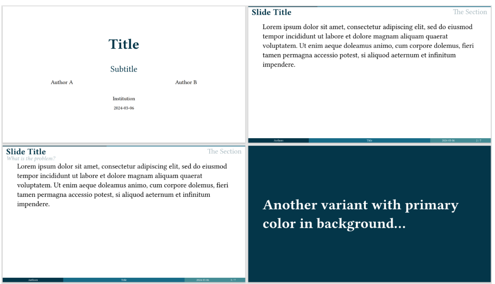
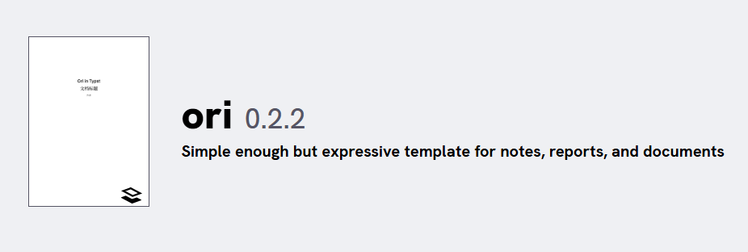

# typst

## 简介

Typst 是可用于出版的可编程标记语言，拥有变量、函数与包管理等现代编程语言的特性，注重于科学写作 (science writing)，定位与 $LaTeX $ 相似。它相比 $LaTeX $ 的优势在于：

* 语法简洁
* 编译速度快
* 环境搭建简单
* 现代编程语言

## 语法

!!!note 注意
    这里的语法都是纯粹的 `typst` 语法，在很多模版里其实都会去支持 markdown 语法，比如有序列表可以用`1. ` ，甚至有的包还会去支持 $Latex $风格的数学公式。

### 标记模式

#### 标题

```typst
= 一级标题
== 二级标题
=== 三级标题
```

#### 强调

```typst
*strong*
_emphasis_
```

#### 列表

```typst
无序列表 - item
有序列表 + item
```

#### 注释

```typst
/* block */
// line
```

### 数学模式

```typst
行内数学公式	$x^2 $
块级数学公式 $ x^2 $
```

### 代码模式

typst 支持函数式编程，这部分比较 advanced，这里不展开。

## 模版推荐

### PPT

PPT 推荐 [touying](https://touying-typ.github.io/zh/docs/intro/)，尤其是[University 主题](https://touying-typ.github.io/zh/docs/themes/university)。



### 文档

文档推荐[ori](https://typst.app/universe/package/ori/)

