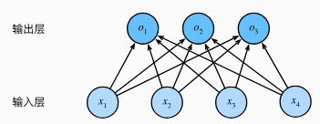

# 逻辑回归
## 二分类
我们将因变量(dependent varible)可能属于的两个类分别称作负向类(negative class)和正向类(positive class)，则因变量属于0~1，其中，0表示负向类，1表示正向类

### 定义
逻辑回归(Logistic Regression)是一种广泛应用于**分类问题**的统计学习方法。尽管名字带有回归，但它其实是一种二分类算法。

逻辑回归通过使用逻辑函数(Sigmoid函数)将线性回归的输出映射到0和1之间，从而预测某个事件发生的概率，概率大于0.5则归为正向类，否则归为负向类。逻辑回归的目标是预测一个二分类结果$y\in \{0,1\} $，公式为$p(y=1|X)=\delta(w^TX+b) $，其中$\delta(z)=\frac{1}{1+e^{-z}} $（常用这个，可以看到这个函数的值域就是0~1），最后的值在0和1之间，可以视为属于类别1的概率.其实这个方法可以理解成在空间中用一条直线把数据点分类两类（以二维为例）

逻辑回归理论上可以用和线性回归一样的代价函数，但是逻辑回归多了一个S函数，如果代入我们将得到一个非凸函数，这样的函数有多个局部最小值，对使用梯度下降不利。所以我们重新定义代价函数。逻辑回归的损失函数是对数损失函数，其形式如下$J(w,b)=-\frac{1}{m}\Sigma_{i=1}^m[y_i\log(h_{\theta}(x_i))]+(1-y_i)\log(h_{\theta}(z_i)) $，其中$h_{\theta}$是逻辑回归的预测概率，这个式子的值可以理解成预测错的概率大小，取对数只是为了方便计算。

### 求解方法
和线性回归一样，通常也用梯度下降法，梯度更新规则如下：
对 \( w \) 的梯度:
\( \frac{\partial J\left( {w,b}\right) }{\partial w} = \frac{1}{m}\mathop{\sum }\limits_{{i = 1}}^{m}\left( {{h}_{\theta }\left( {x}^{\left( i\right) }\right)  - {y}^{\left( i\right) }}\right) {x}^{\left( i\right) } \)
对 \( b \) 的梯度:
\( \frac{\partial J\left( {w,b}\right) }{\partial b} = \frac{1}{m}\mathop{\sum }\limits_{{i = 1}}^{m}\left( {{h}_{\theta }\left( {x}^{\left( i\right) }\right)  - {y}^{\left( i\right) }}\right) \)

## softmax 回归
### 定义
Softmax回归（Softmax Regression），也称为多类逻辑回归（Multinomial Logistic Regression），是用于多分类问题的经典模型。它是逻辑回归的推广，适用于类别数大于2的情况。

在二分类里面相当于是01分布，但是在多变量回归里面仍需要满足概率总和为1，每一个概率都非负，那么如何构造这样的函数呢？

结论是$\hat{y_j}=\frac{exp(o_j)}{\Sigma_k exp(x_k)} $，其实逻辑回归亦满足这个式子，尽管这个函数是非线性的，但是回归的结果是由输入特征的线性组合决定的，所以这仍然是一个线性模型

### 损失函数
损失函数来自极大似然法，$P(Y|X)=\Pi_{i=1}^n P(y^{(i)}|x^{(i)}) $，使这个概率最大，相当于最小化（我们在深度学习里面更喜欢最小化）负对数似然，可得损失函数为$l(y, \hat{y})=-\Sigma_{j=1}^q y_j\log \hat{y_j} $，这个损失函数又被称作交叉熵损失

将softmax的归一化函数代入化简可得$l(y, \hat{y})=\log \Sigma_{k=1}^qexp(o_k)-\Sigma_{j=1}^qy_jo_j $，对这个式子求导可得$\partial_{o_j}l=softmax(o)_j-y_j $，这个结果类似于线性回归里面的$y-\hat{y} $