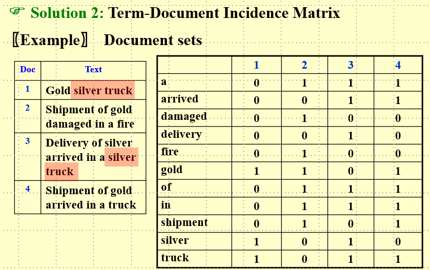

# 潜在语义分析
!!!note
    这个其实和 NLP 相关，不过确实是一种非监督学习方法
## 定义
潜在语义分析(latent semantic analysis,LSA)主要用于文本话题分析，其特点是通过**矩阵分解**发现文本与单词之间基于话题的语义关系。

## 策略
### 单词向量空间
#### 定义
单词向量空间模型(word vector space model)的基本想法是给定一个文本，用一个向量表示该文本的“语义”，向量每一维对应一个单词，其数值为该单词在该文本中出现的频数或者权值，基本假设是：
* 文本中所有单词出现情况表示了文本的语义内容；
* 文本集合中每一个文本都表示为一个向量，存在与一个向量空间；
* 向量空间的度量，如内积或标准化内积表示文本之间的“语义相似度”

这种结构其实在ads里面出现过，不过这里有一些改进，权值不再是单纯的出现次数，而是改成了单词频率-逆文本频率表示

#### TF-IDF
单词频率-逆文本频率(TF-IDF)的解释如下：

1. TF (Term Frequency, 词频)
表示某个单词在文档中的出现频率,通常计算方式如下：
${TF}\left( t\right)  = \frac{\text{ 某个词 }t\text{ 在文档 }d\text{ 中出现的 }}{\text{ 文档 }d\text{ 中的总词数 }}$
这个值越高,说明该单词在该文档中越重要。
2. IDF (Inverse Document Frequency, 逆文档频率)
衡量某个单词在整个文档集合中的重要性,计算方式：
${IDF}\left( t\right)  = \log \frac{N}{1 + {DF}\left( t\right) }$
其中:
- $N$ 是文档总数
- ${DF}\left( t\right)$ 是包含词 $t$ 的文档数量
- 加 1 主要是为了避免分母为 0 。

综上所述：
$$TF-IDF=TF\times IDF $$

#### 单词-文本矩阵
假设有m个单词,n段文本，那么单词-文档矩阵表示如下，其中$x_ij$表示在第j篇文章中第i个单词的 TF-IDF：

$X = \left\lbrack  \begin{matrix} {x}_{11} & {x}_{12} & \cdots & {x}_{1n} \\  {x}_{21} & {x}_{22} & \cdots & {x}_{2n} \\  \vdots & \vdots & \cdots & \vdots \\  {x}_{m1} & {x}_{m2} & \cdots & {x}_{mn} \end{matrix}\right\rbrack$

$X$ 构成原始的单词向量空间,每一列是一个文本在单词向量空间中的表示，两个单词向量的标准化内积就表示了文本之间的语义相似度。

单词向量通常是稀疏的，所以其实点乘的计算效率很高，但缺点是一个单词可以根据上下文有多个含义，多个单词也可以是同义词或者近义词，单纯的比较相同的单词并不能很好地统计文档的相似度。

### 话题向量空间
这是针对单词向量的完善，两个文本的相似性体现在它们的话题相似性上，如果两个文本话题相似，那么两个文本也应该语义相似。**话题向量空间其实是单词向量空间的一个子空间。**

假设所有文本共含有 $k$ 个话题，每个话题由一个定义在单词集合 $W$ 上的 $m$ 维向量表示,称为话题向量。
可以获得其单词-话题矩阵 $T$ 
$T = \left\lbrack  \begin{matrix} {t}_{11} & {t}_{12} & \cdots & {t}_{1k} \\  {t}_{21} & {t}_{22} & \cdots & {t}_{2k} \\  \vdots & \vdots & \cdots & \vdots \\  {t}_{m1} & {t}_{m2} & \cdots & {t}_{mk} \end{matrix}\right\rbrack$ 
$T$ 构成原始的单词向量空间,每一列是一个话题在话题向量空间中的表示。

### 线性变换
将词向量投影到话题空间中，可以得到一个新向量$y_j$(k维)，对整个单词-文档矩阵进行这个操作就可以得到话题-文本矩阵。

这样，单词空间中的词向量$x_j$可以由话题空间中的向量$y_j$近似表示$x_j\approx y_1t_1+y_2t_2+...+y_nt_n $，即$X\approx TY $，这个就是潜在语义分析。直观上潜在语义分析是将文本在单词向量空间的表示通过线性变化映射到话题向量空间中。

## 算法
