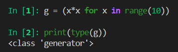
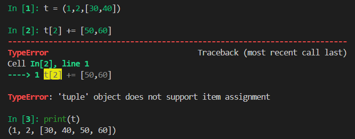

# 内置类型
首先非常重要的一点，Python里面一切皆对象，包括内置的基础类型，比如`float`，如果按照C/C++的习惯，这就是一个基础类型，不算对象，但是在Python中它就是对象，而且是用C实现的，其实现为:
* `ob_refcnt`:对象的引用计数
* `ob_type`:指向对象的指针
* `ob_fval`:一个C语言的double类型，存放`float`的值

## 丰富的序列
### 分类
Python 标准库用C语言实现了丰富的序列类型，包括：

* 容器序列：**可以存放不同的项**，包括嵌套容器，比如list和tuple
* 扁平容器：仅存放一种简单类型的项，比如str和array.array

也可以分为，可变序列继承不可变序列的所有方法：
* 可变序列：list,array.array等
* 不可变容器：tuple,str等

### 一点技巧
#### 切片
`start:end"step`表示切片，每一个参数都可以省略。`[::]`表示复制，`[::-1]`表示反转
#### 迭代
Python的for是高度抽象的，可以用在任何可迭代对象上，那么如何判断一个对象是否可迭代呢，可以通过`collection.abc`模块的`Interable`判断。
```python
isinstance('abc',Iterable)
```

如果要实现对下标的迭代，可以像C里面那么写，但是也可以用`enmerate`把一个list变成索引-元素对
```python
for i,val in enmerate(['a','b','c']):
    print(i,value)
```
#### 列表推导式
可以快速构建一个序列，此外Python会忽略[]、{}和()内部的换行，所以过长的代码可以跨行写
``` py
# 不使用列表推导式
l1 = []
for i in range(10):
    l1.append(i)
# 使用列表推导式
l2 = [j for j in range(10)]
```

#### 生成器表达式
列表推导式显然直接只能生成列表，如果需要其他序列还要加一次转换，会产生不必要的列表对象。生成器表达式语法几乎和列表推导式一模一样，只不过把方括号换成圆括号而已。比如
``` py
colors = ['black', 'white']
sizes = ['S', 'M' , 'L']
for tshirt in (f'{c} {s}' for c in colors for s in sizes):
    print(tshirt)
```
但其实这个并不是生成元组，而是创建了一个生成器，生成器并不会直接生成完整的序列，而是依次生成的，这样可以节省空间


生成器除此以外还有另外一种定义方法，一个函数含有`yield`关键字，那么它就不再是普通的函数了，而是一个生成器函数。生成器函数和普通函数的执行顺序不一样，生成器函数每次调用`next()`时执行，遇到`yield`返回，比如
```py
def fib(max):
    n, a, b = 0, 0, 1
    while n < max:
        yield b
        a, b = b, a + b
        n = n + 1
    return 'done'
# f是一个生成器
f=fib(6)
# 输出 1
print(next(f))

# 可以用for迭代生成器
for val in f:
    print(val)
```

但是你会发现一个问题，如果我们迭代这个生成器，我们到报错都拿不到`return`返回值，如果想要拿到返回值，必须捕获`stopInteration`错误，返回值在其`value`中

#### 迭代器
这里不同于C++，在Python中可以被`next`函数调用并不断返回下一个值的对象称为迭代器，生成器是可迭代的，也是迭代器，但是`list`,`dict`,`str`是可迭代的，但并不是迭代器，可以用`iter()`把它们变成迭代器

### 元组
元组是Python中比较特殊的存在，它不仅仅是不可变列表
#### 用作记录
其实感觉就像是把元组当成一个特殊的数据对象，项的位置决定一个字段的数据
#### 用作不可变列表
这个在初学Python的时候就是这么说的，在代码中看见元组，你就知道它的长度永不可改变。但是，元组的不可变特性仅仅针对元组中的引用而言，如果引用的是可变对象，那么元组中的值会随对象的改变而改变。比如
``` py
t = (1, 2, [30,40])
t[2] += [50,60]
```
这个有问题吗？显然是有的，毕竟元组“不可变”，但是它的结果确实是很诡异的，可以看到确实是报错了，但是同时确实真的加进去了



### 拆包
拆包的特点是不需要手动通过索引从序列中提取元素，这样减少了出错的可能性。

最明显的拆包形式是**并行赋值**
``` py
pos = (1,1)
x, y = pos
```
或者比如
``` py
a, b = b, a
```
以及在调用函数时可以拆包当作形参或者从整合的返回值中提取想要的值
``` py
# 允许函数接收任意数量的位置参数，并将它们打包成一个元组
f(*t):
    pass
```

### 切片
切片的功能比你想象的更加强大，常规的切片语法无非是`[start:end:step]`，区间排除最后一项，得到的结果是一个切片对象，也就是说你可以给一个切片赋值

### 拼接
都知道`+`用于连接序列，`*`用于重复序列，但是一般来说得是不可修改的同类对象。如果对可变对象使用`a*n`这种语法，会出现一些出乎意料的问题，比如`my_list = [[]] * 3`初始化一个嵌套列表，确实得到了一个嵌套列表，但是嵌套的三个引用指向了同一个列表。

### 排序
`list.sort`方法就地排序，即不创建副本，返回值为None。这是Python API 的一个重要约定，就地更改对象的函数或方法应该返回 None。此外，Python 还提供 `sorted` 用于返回排好序的对象。

Python 的标准库使用的是 **Timsort**，这是一种混合的、稳定的排序算法，它巧妙结合了插入排序和归并排序的优点，针对数据集中的有序性进行了精确的优化，尤其适合处理包含大量部分有序子序列的数据集。最优情况时间复杂度接近$O(N)$

### 其它序列
#### 数组
如果一个列表只含数值，那么使用array.array会更高效。Python的数组像C语言一样精简，创建Array时需要提供对应类型代码，用于决定底层使用什么C类型存储数组中的各项。

#### memoryview
说实话，我以前都没听说过这个（

内置的 memoryview 是一种共享内存的序列类型，可在不复制字节的情况下处理数组的切片。比如同一段6字节数组，既可以是6字节数组，也可以处理成1\*6,2\*3.3\*2的矩阵。但是如果要做一些高级数值处理，则推荐使用 NumPy 库，其实NumPy中的Array对象和这个是差不多的。

## 字典和集合
Python 是一个巨大的字典，没有Python程序不使用字典，即使不直接出现在自己编写的代码中，也会间接用到。Python中的字典和集合都是基于哈希表实现，所以它们的元素都必须是可以哈希的。

### 字典
#### 迭代
字典是可以迭代的，但是默认是对key迭代，如果要对value迭代，可以用`for val in d.values()`，如果要同时迭代，可以`for k,v in d.items()`

#### 字典推导式
字典推导式可以从任何可迭代对象中获取键值对
``` py
dial_codes = [
    (86, 'China'),
    (81, 'Japan'),
    (1, 'United States')
]
country_dial = {country: code for code, country in dial_codes}
```
#### 映射拆包
首先，调用函数时，不止参数可以使用**。但是，所有键都要是字符串，而且在所有参数中是唯一的。
``` py
# 允许函数接收任意数量的关键字参数，并将它们打包成一个字典
def dump(**kwargs):
    return kwargs
dump(**{'x':1},y=2,**{'z':3})
# output: {'x': 1, 'y': 2, 'z': 3}
```
其次，**可以在dict字面量中使用，同样可以多次使用

#### 默认值字典
根据Python的“快速失败”原则，当键k不存在时，d[k]抛出错误。但是如果你想要默认值呢？这种情况下可以使用collection中的defaultdict

### 集合
集合是一组值不重复的对象，基本作用就是去重。空set没有字面量语法，必须写作`set()`，**`{}`默认是空字典**。
#### 实现与实践
set也是用哈希实现，所以集合元素必须是可哈希对象。元素的顺序取决于插入顺序，但是顺序是没有意义的，其一是集合本身就并非顺序容器，其二是哈希表里面有个操作是`rehashing`，这个操作会改变顺序。
#### 集合运算
集合有一些额外的运算：
* 交集：`&`
* 并集：`|`
* 差集：`\`
* 对称差集：`^`