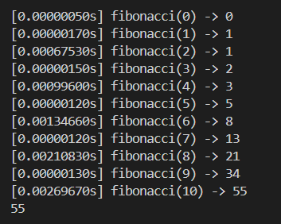

# 函数式编程
Python 不是纯粹的函数式语言，但它支持多种函数式编程特性。

## 函数是一等对象
通常把“一等对象”定义为：
* 在运行时创建
* 能赋值给变量或者数据结构的元素
* 能作为参数传递给函数
* 能作为函数的返回结果

简单理解为函数名其实是一个指针变量，可以对它进行赋值、返回等操作，函数对象有一个`__name__`属性，是函数的名称

### 把函数视作对象
Python的函数就是对象


### 高阶函数
接受函数作为参数或者把函数作为结果返回的函数是高阶函数，典型代表就是内置的`map`和`filter`以及`sorted`

#### map
`map`可以把一个函数的效果作用到一个可迭代对象的每个，把新的结果作为**生成器**返回，所以如果你想要列表得再用`list`进行强制类型转换

#### reduce
`reduce`可以把累计序列计算值与下一个元素做累积计算

比如我们可以实现一个字符串转数字的函数
```py
from functools import reduce
def f(x,y):
    return x*10+y
def bit_trans(x):
    digits = {'0': 0, '1': 1, '2': 2, '3': 3, '4': 4, '5': 5, '6': 6, '7': 7, '8': 8, '9': 9}
    return digits[x]
def str_to_int(s):
    return reduce(f,map(bit_trans,s))
```
#### filter
`filter`用于过滤，第一个参数应该是认为返回布尔值的函数，最后还是返回一个迭代器
#### sorted
`sorted`用于返回一个排序好的列表，形式是`sorted(list,key=<,reverse=False)`，`key`可以为任意函数，一般可以写一个匿名函数，如果需要一些特殊规则的话

### 匿名函数
使用lambda关键字可以创建匿名函数，格式是形如`x:x*x`，前面是变量，后面是函数体，不需要写return，然而受Python简单语法的限制，lambda函数主体只能是纯粹的表达式，也就是不能有while、try等python语句。除了作为参数传递给高阶函数，Python很少使用匿名函数。

### 用户定义的可调用类型
既然Python中的函数可以当作对象，那么为什么对象不能当作函数调用？为此，只需要实现实例方法`__call__`

``` py
import random

class BingoCage:
    def __init__(self,items):
        self._items = list(items)
        random.shuffle(self._items)# 打乱顺序
    def pick(self):
        try:
            return self._items.pop()
        except IndexError:
            raise LookupError('pick from empty BingoCage')
    def __call__(self):
        return self.pick()
```
`BingoCage`本身可以当作函数调用，相当于是`BingoCage.pick()`的快捷方式

## 装饰器和闭包
### 装饰器
#### 基础知识
装饰器是一种可调用对象，其参数是另外一个函数（被装饰的函数）。装饰器可能会对被装饰的函数做一些处理，然后返回函数，或者把函数替换成另一个函数或可调用对象，作用是可以动态地给函数添加功能。实际上，装饰器就是一个返回函数的高阶函数

**装饰器有一个关键特性，它们在被装饰的函数定义之后立即执行，这通常是在导入时。**

#### 作用域规则
Python的规则和C/C++有一点点区别，比如
``` c++
#include<iostream>

using namespace std;

int b = 6;
void f(int a){
    cout << a << ' ';
    cout << b << endl;
    int b = 9;
}

int main(){
    f(3);
}
```
这段代码显然是正确的，`f`里面的`int b`定义的局部变量虽然会覆盖全局的`b`，但是全局的`b`先被输出了，所以结果是`3 6`。但是换成python，结果就不一样了
``` py
b = 6
def f(a):
    print(a,end=' ')
    print(b)
    b = 9
f(3)
```
这段代码会直接报错，错误是`UnboundLocalError: cannot access local variable 'b' where it is not associated with a value`，这说明Python判定`b`是局部变量，会尝试从局部获取值，但是一开始又没有赋值，所以会直接报错。

这并不是bug，而是一种设计选择：Python不要求声明变量，但是会**假定在函数主体中赋值的变量是局部变量**。

此外，Python其实针对上述问题提供了解决方案，即使用`global`指定b为全局变量，注意`b`运行后的值是9
``` py
b = 6
def f(a):
    global b
    print(a,end=' ')
    print(b)
    b = 9
f(3)
```

另外Python的局部作用域也是特殊的，if-else，for,while中定义的“临时”变量其实会一直存在，比如
```py
x = 1
if(x>0):
    y=1
else:
    y=2
# 输出 1
print(y)
```

#### 闭包
闭包其实就是延伸了作用域的函数，包括函数主体中的非全局变量和局部变量。
``` py
# 动态返回平均值
def make_averager():
    series = []
    def averager(new_value):
        series.append(new_value)
        total = sum(series)
        return total/len(series)
    return averager
# 调用
avg = make_averager()
avg(10)
avg(11)
avg(12)
```
`series`是`make_averager`函数的局部变量，但是我们其实只调用了一次`make_averager`，当调用`avg`的时候`make_averager`已经返回，局部作用域已经消失，`series`就变成了一个自由变量（即未在局部作用域中绑定），但是它是仍然存在的。

也许你会觉得上面那段代码写的并不好，为什么要用一个列表存？直接记录总和以及总数量不行吗？还真不行
```py
def make_averager():
    count = 0
    total = 0
    def averager(new_value):
        count += 1
        total += new_value
        return total / count

    return averager
avg = make_averager()
avg(10)
```
事实上这段代码会报错`UnboundLocalError: cannot access local variable 'count' where it is not associated with a value`，原因是在`average`中对`count`赋值了，这会导致`count`被认为是局部变量，就不再是自由变量，也就不在闭包中了。为了解决这个问题Python提供了`nonlocal`关键字，它的作用是把变量标记为自由变量，如果为`nonlocal`声明的变量赋予新值，那么闭包中绑定的值也会随之更新。

还有就是返回闭包时**不能包含循环变量**，因为返回函数并没有被立即执行
```py
def count():
    f = []
    for i in range(3):
        def f():
             return i*i
        f.append(f)
    return f
# 答案都是2，因为这三个函数都是同一个闭包，i最后为2
f1, f2, f3 = count()
```
如果一定要这么干该怎么办，可以再套一层函数
```py
def count():
    f = []
    def g(j):
        return j*j
    for i in range(3):
        f.append(g(i))
    return f
# 答案依次是 0,1,2 因为g被立即调用了，所以绑定到的是当时的循环变量值
f1, f2, f3 = count()
```

#### 实现一个装饰器
``` py
# 可以打印出函数调用的耗时，接受的参数和返回的值
import time
import functools

def clock(func):
    # 保留被装饰函数的元信息（如名称、文档字符串等）
    @functools.wraps(func)
    # *args,**kwargs表示任意参数
    def clocked(*args,**kwargs):
        t0 = time.perf_counter()
        result = func(*args,**kwargs)
        elapsed = time.perf_counter() - t0
        name = func.__name__
        arg_lst = [repr(arg) for arg in args]
        arg_lst.extend(f'{k}={v!r}' for k,v in kwargs.items())
        arg_str = ','.join(arg_lst)
        print(f'[{elapsed:0.8f}s] {name}({arg_str}) -> {result!r}')
        return result
    return clocked
```

#### 标准库中的装饰器
##### functool.cache
`functool.cache`装饰器实现了备忘(memoization)，这是一项优化技术，能把耗时得到的结果保存起来，避免传入相同的参数时重复计算。
``` py
# 一个例子，计算斐波那契数
import functools

# 这个是上面自己实现的记录函数执行信息的装饰器
from clockdeco import clock

@functools.cache
@clock
def fibonacci(n):
    if n<2:
        return n
    return fibonacci(n-2) + fibonacci(n-1)

if __name__ == '__main__':
    print(fibonacci(10))
```
结果如下，除了最后一行都是由`clock`装饰器返回的



#### 偏函数
这里的偏函数不同于数学的定义，这里的偏函数是指的固定函数的某些参数，比如可以从标准库的`int()`得到一个向二进制的转换
```py
import functiontools
# 把int的base参数指定为2
int2 = functiontools.partial(int,base=2)
```