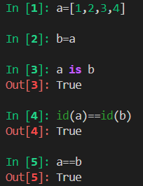
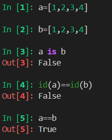
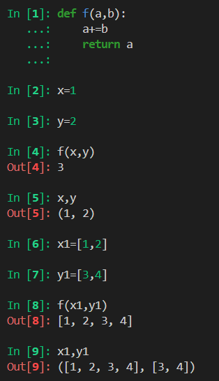
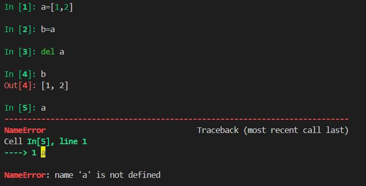

# 对象引用、可变性和垃圾回收
## 变量不是盒子
C语言应该可以说变量是盒子，但是这对于Python是不成立的。比如
``` py
a = [1,2,3,4]
b = a
a.append(5)
print(b)
```
在上面的代码中a和b其实指向了同一段内存，相当于C++中的引用，只是对应的那一段内存的别名
## 相等
承接上述代码，可以看到直接复制确实是相当于绑定了一个别名



但是考虑另一种情况，a和b的内容是完全相同的



按照上面的输出我们可以知道`==`是用于比较两个对象的值，而`is`比较对象的标识

## 拷贝
Python赋值默认是做浅拷贝。Python中为任意对象做浅拷贝和深拷贝非常简单，直接使用copy模块提供的copy和deepcopy函数

## 参数传递
Python只支持共享传参，函数内部的形参是实参的别名，也就是说函数内对形参的操作是会影响实参的，但前提是实参是可变对象，比如



## del和垃圾回收
首先，del不是函数而是语句，其次del删除引用，而不是对象，del可能导致对象被当作垃圾回收，但是仅当删除了变量的最后一个引用时，有点像C++的shared_ptr，比如：


