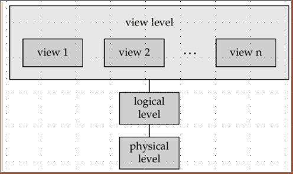
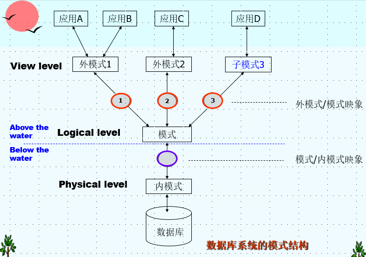
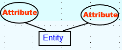
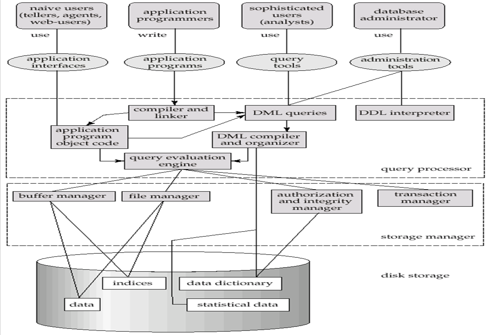
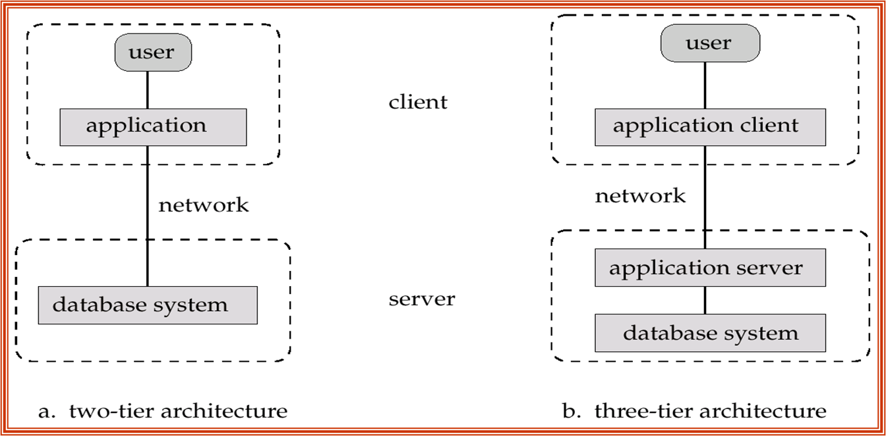

# 导论

导论几乎就是**名词解释**，出现了一大堆概念，其实几乎就是整个学期的知识，前期不理解也没关系

## 内容

### 名词解释

!!!note DBMS 和 DB的区别
    数据库是用于存储数据的有组织的数据集合，而数据库管理系统是管理数据库的软件系统，提供创建、访问、操作和维护数据库的功能

* DBMS:Database Management System 数据库管理系统
* SQL:Structred Query Language 结构化查询语言
* Database:A collection of <font color=blue>interrelated data</font>,relevant to an enterprise.
* tuple:元组，可以指表的一行数据
* column/field:表的一列

### 文件管理系统和数据库系统的对比

文件管理系统由传统的 操作系统 支持：

* 当需要操作数据时需要新的写应用程序和创建新的数据文件
* 数据文件会以不同形式储存，相互之间是独立的

### 文件管理系统的缺点

* 数据冗余和不一致：
  * 多种文件形式，信息会在不同文件之间重复
* 在访问数据方面存在困难
  * 为了完成新的任务需要写新的程序
* 数据孤立：
  * 多种文件和多种格式导致索取和分享困难
* 完整性问题：
  * 完整性受限，比如要求账户余额大于0，这个条件会成为程序代码的一部分
  * 难以增加新的限制条件和修改已经存在的数据
* 没有原子性的更新
  * 失败的操作可能会导致数据处于不一致的状态因为部分更新，比如转账，要求应该是么转过去了，一方减，另一方增，要么转账失败，余额不变
* 不能够被多位用户并发访问
  * 不受控的并发访问会导致数据不一致，比如两个人同时修改一处数据
* 安全问题：鉴权

**而数据库能解决以上所有问题**

### 数据抽象的层级

* 物理层(Physical level)：描述一条记录是如何存储的 <font color=red>Files</font>
* 逻辑层(Logical level)：描述数据是如何存储在数据库中的和在更高层级的数据之间的关系(reletionship)。就有点像OOP中的一个类，一个record类有这些元素（大概是这种感觉

```C++
//这里只是一个示例
type student=record
            sid: integer;
            sname: string;
            gender: string;
            age: integer;
            deptno: integer;
        end;
```

* 视图层(View level)：也就是你最终看到的样式，应用程序隐藏了数据类型的细节。处于安全考虑视图也可以隐藏信息，比如员工工资



### 模式和实例

类似于编程语言中的类型和变量

模式(schema)是数据库中不同层的结构：

* Physical schema:数据库在物理层的设计
* Logical schema:数据库在逻辑层的设计
* Subschema:视图层的模式

实例(Instance)是在某一时刻数据库中实际的内容



### 物理独立和逻辑独立

独立(Independence)是指在不影响上层模式的情况下修改下层模式定义的能力，类似解耦的概念：

* Physical Independence:在不修改 logical schema 的情况下调整 physical schema 的能力
* Logical Data Independence:保护应用程序不被数据逻辑结构的改变所影响

### 数据模型

Data Model is a collection of conceptual tools for describing:

* data structure
* data relationships
* data semantics
* data constraints

不同的数据模型有：

* Entity-Relationship model(ER 模型)
* Relational model(关系模型)
* 其他模型：
  * object-oriented model
  * semi-structured data models(XML)

#### 设计数据库的步骤

1. 分析需求
2. 设计 conceptual database
3. 设计 logical database
4. 模式完善
5. 设计 physical database
6. 创建和初始化数据库和设计安全系统

#### ER 模型

E-R model包含：

* Entities(objects):有点像是一个对象，它有很多属性
* Relationships between entities



#### 关系模型

其实就是关系型数据库中的一张表

### 数据库语言

SQL=DDL+DML+DCL:

* DDL:Definition
* DML:Manipulation
* DCL:Control

SQL有几种用法：

* 直接在交互环境中使用比如mysql
* 在图形化界面中使用，比如SSMS
* 内嵌的SQL，这个几乎不会用
* ODBC、JDBC这种用于连接数据库的库
* ORM框架

### 数据库的用户

* Naive user
* Application programmer
* Sophisticated user
* Specialized user

### 数据库管理员

DBA(Database adminstrator)：一维有着管理所有数据库和访问所有程序权限的特殊用户

### 数据库系统结构

本学期后半期的大程将围绕这个，这里只提一下（

* Storage manager
* Query processor



### 应用架构

中间件(middleware)，这是两层结构和三层结构最核心的区别


### 单词备忘

都是PPT中出现过的词

* scalability 可扩展性
* integrity 完整性
* robustness 鲁棒性
* redundancy 冗余
* inconsistency 不一致
* integrity 完整性
* atomicity 原子性
* current 并发
* schema 模式
* analogous 类似的
* semantics 语义
* refine 完善
