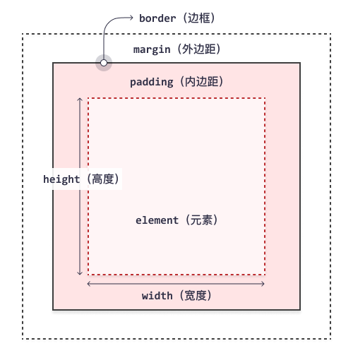

# CSS
## 基础语法
CSS(cascading style sheets)，即层叠样式表，用来控制html的具体样式，可以把html当成骨架，CSS就是包裹在html外的皮肤

``` css
<style>
.iofo {
    color: green;
    font-family: Arial;
    font-size: 24pt;
}
</style>
<html>
    <div class="iofo">
        a
    </div>
</html>

```

其中.info称作选择器(selector)，其实就是对应的html标签，冒号前面成为属性(property)，后面称为值(value)，效果如下所示：

<style>
.iofo {
    color: green;
    font-family: Arial;
    font-size: 24pt;
}
</style>

<html>
    <div class="iofo">
        a
    </div>
</html>

### 选择器
简单来说就是用来查找Html的标签，最常见的就是id和class，它们的区别是id在页面中是唯一的，但class的实例可以有很多个。其他的，比如还有伪类选择器，会根据特定的状态选取元素，比如鼠标放在上面会虚化
### 用法
#### 外部CSS
把CSS单独写在`.css`文件里面，要用到时使用`<link>`导入
#### 内部CSS
就是写在html的`<style>`中，这样做的话，一个页面的样式是唯一的
#### 行内CSS
直接加到单个元素的html标签中
## 常见属性
CSS有非常非常多的属性可以指定，所以并非什么都要记下来（ 而且其实都是对应的英文单词，这里举一点例子
### 颜色
颜色可以用多种方式指定，比如名称，RGB，16进制值等。也有多处颜色可以指定：
* 背景色：background-color
* 文字颜色：color
* 边框颜色：border
### 背景
使用`background-image: url()`
### 边距
外边距`margin`，内边距`padding`

---

CSS实际上可以用下面这个模型表示



## 进阶语法
这些用法一般会和JS的操作相关
### 隐藏
有两种方法隐藏，一个是把`display`设为`none`，也可以将`visibility`设为`hidden`，区别是后者只是单纯不显示，但是还是要占位

### 浮动
浮点`float`，即图像应该在图像的左边还是右边，利用浮动可以便捷地并排图像

### 组合器
可以给简单的选择器指定一些规则
### 后代选择器
比如`div p`可以选择`<div>`中所有的`<p>`元素
### 子选择器
比如`div > p`可以选择属于`<div>`的所有子元素的所有`<p>`元素
### 相邻兄弟选择器
比如`div + p`可以选择`<div>`之后所有`<p>`的元素
### 通用兄弟选择器
比如`div ~ p`可以选择`<div>`所有同级的`<p>`元素

### 伪类
最常见的是鼠标悬停在上面的效果和访问之后改变状态
<!DOCTYPE html>
<html>
<head>
<style>
/* unvisited link */
a:link {
  color: red;
}

/* visited link */
a:visited {
  color: green;
}

/* mouse over link */
a:hover {
  color: hotpink;
}

/* selected link */
a:active {
  color: blue;
}
</style>
</head>
<body>

<h1>CSS 链接</h1>
<p><b><a href="/index.html" target="_blank">这是一个链接</a></b></p>

</body>
</html>


此外还有一个`first-child`较为常见，比如
```css
p:first-child {
  color: blue;
}
```
会匹配作为任何元素的第一个子元素的任何`<p>`元素

### 伪元素
用于设定元素指定部分的样式，比如设置首字母、首行的效果以及在之前和之后插入一些效果

### 属性选择器
用于选取指定属性以指定值开头的元素，比如
```css
a[target="_blank"] { 
  background-color: yellow;
}
```
可以选取选取所有带有 `target="_blank"` 属性的 `<a>` 元素