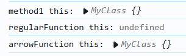
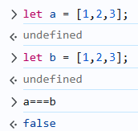
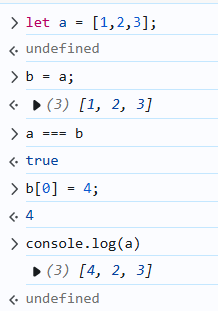

# JavaScript
!!!note
    这里采纳ES6的标准，尽量严格要求代码规范

* JavaScript是用来控制网页的元素的，即实现动态网页。
* JS和Java没有任何关系，但是相比于html和css js才是真正普遍意义上的编程语言。
* JS的开发只花了两周时间，虽然开发他的人很强，但是架不住时间太紧，所以JS的语法有很多地方都有不小的问题

## 语法
### 基础
#### 类型

JS 只有五类基础数据类型：
* 布尔类型
* 数字，不区分整型和浮点
* 字符串，不区分单双引号
* NULL
* Undefined


!!!note
    undefined 表示声明了但是没有赋值；NULL表示不存在这个值

#### 运算符
* 算术运算，对string有重载
* 比较运算符

#### 定义变量
JS 使用 `let`或者`var`定义变量，这两个在作用域上会有区别，JS语句需要使用`;`来结尾，可以使用`const`来定义常量，如果一个变量从未改变那么最好要写成`const`，但是由于JS一切皆对象，变量名更像是一个指针，所以所谓的改变是指指针的指向有没有改变。也就是哪怕是`const`，也只是说明这个变量不能变，但是变量指向的对象是可以改变的。

下面用一个例子说明`let`和`var`的区别，并不推荐使用`var`，因为这种情况往往可以用`const`

```js
for(var i=0;i<10;i++){
    console.log(i);
}

console.log(i);

for(let j=0;j<10;j++){
    console.log(j);
}

//上面都是正确的，但是这行会报错
//因为let创建的是块级对象，离开块会自动销毁
console.log(j);
```

#### 注释
JS使用`//`，和C/C++一样，不同于脚本语言喜欢用`#`

#### 字符串
JS中字符串是基础类型，有`split`和`replace`等常用方法

#### 数组
JS使用`[]`表示数组，JS提供了`pop`、`push`和`slice`等方法(`length`是属性)。但是JS的数组不同于C，数组的内容可以是任意类型的组合。此外，JS不会进行越界检查，越界访问数组并不会报错，而是会在中间添加`undefined`并扩展数组，所以要尽量避免发生这种情况。

#### 输出
JS通常使用`console.log(message)`，但是还有`alert（message）`，但其实这是用来输出一些运行信息的，在debug时很有用。

#### 分支/条件语句
同C，并且是使用花括号区分代码块

#### 函数
可以使用`function`创建函数，也可以用`=>`创建函数，但是这二者是有区别的，`const`创建的函数并不会创建新的`this`，这涉及到了JS对象中`this`的绑定机制。要了解这一机制，还需要知道JS中函数是一等的对象，也就是说函数可以像一般对象一样操作，比如在函数里面定义子函数或者把函数绑定给其他变量。

```js
//这是一个返回函数的例子
function f(){
    console.log(this);
    const g = (x) => {
        console.log(this);

        return x*x;
    }
    return g;
}
//这里h和g是等价的，是同一个函数
h=f();
//结果是9，即x的平方
console.log(h(3));
```

至于this，this是指向当前的对象，至少我们想让它有如此行为，但是在嵌套定义函数时会出问题
```js
class MyClass {
  method1() {
    console.log('method1 this:', this);
    
    function regularFunction() {
      console.log('regularFunction this:', this);
    }
    regularFunction();

    const arrowFunction = () => {
      console.log('arrowFunction this:', this);
    }
    arrowFunction();
  }
}

const obj = new MyClass();
obj.method1();

```

结果如下

可以看到箭头函数并没有影响`this`的绑定，但是`function`会，这里会直接导致`this`绑定成`undefined`

#### 其它内置函数
##### map
map 会基于给定的函数和数组创建一个新数组，即建立一个映射，比如
```js
let myArray = [1,2,3,4];
newArray = myArray.map(x => x*3);
```

##### filter
返回一个按照给定函数筛选之后的数组，比如
``` js
let myArray = [1,2,3,4];
newArray = myArray.filter(x => x>2);
```

##### forEach
用来对数组中的每个元素执行一个指定的函数，和`map`的区别是不会返回新的数组，而是返回`Undefined`

##### call
调用函数，并指定 this 的值，后面跟随的参数会被依次传递给函数

##### apply
与 `call` 相似，不同之处在于，`apply` 接收的是一个参数数组，而 `call` 是逐个传参

### 类
#### 对象
JS 中的对象是键值对`name:value`的集合，这其实就是其他面向对象编程语言里的对象，只是形式不同，比如
```js
const myCar =  {
    maker : "China",
    year : 2025,
    color : "red"
};

console.log(myCar.maker);
console.log(myCar[`color`]);
```
这里的对象其实就是指实例，它是具体的，每个键的值都给定了，所以一开始JS的继承是原型链继承，但是ES6引入了`class`语法，JS的继承就和C++差不多了

#### 相等性
相等在 JS 里面特别“奇怪”，必须使用`===`比较**原始值**是否相等，但是对于数组它是按名等价的，而不是按照实际内容。



实际上 JS 中的对象名相当于是C++中的引用（指针），它们指向存储数据的实际地址，比较相等实际上是比较地址是否相同，下面这个数组拷贝说明了这一点，直接用`=`赋值数组是浅拷贝的，并没有开辟新的内存。



在 JS 中正确的深拷贝语法如下，有点像解包
``` js
let arr = [1,2,3];
let copy = [...arr];
```

其它编程语言中的相等`==`在JS中用于检验类型转化后的值是否相同，通常不会使用，更多时候甚至是不允许使用

#### class
ECMAScript 2015，也称为 ES6，引入了 JavaScript 类。本质上**JavaScript 类是 JavaScript 对象的模板**。
``` js
class Rectangle {
    constructor(width,height){
        this.width=width;
        this.heoght=height;
    }
    //这里不需要fucntion关键字了，因为只能是函数
    getArea = () =>{
        //this指向对象本身
        return this.width*this.height;
    };
}
```

JS里面使用`extend`关键字继承，`super`可以用来引用父类方法（和Python一样

### 添加
``` html
<script src="xxx.js"></script>
```

### DOM操作
JS可以对DOM对象进行操作，也就是可以修改html对象。DOM将html表示为一个树形结构，期中每一个元素、属性和文本都是一个对象。
#### 搜索元素
* `getElementById`:返回具有特定id的元素
* `getElementsByClassName`：返回所有具有指定class的元素集合
* `getElementsByTagName`：返回具有指定标签的所有元素集合
* `querySelector`：返回匹配CSS选择器的第一个元素
* `querySelectorAll`：返回所有匹配CSS选择器的元素伪数组
#### 访问元素
* `firstElementChild`:只返回该元素的第一个元素节点
* `nextElementSibling`:返回下一个相邻元素节点
#### 修改元素
* `innerHTML`：获取或设置元素的HTML内容
* `innerText`：获取或设置元素的文本内容
#### 添加元素
* `appendChild`:可以将html对象添加到当前对象末尾
* `insertAdjacentHTML`:直接添加html，一般选用`'beforeend'`添加新元素
#### 修改CSS
* `element.style.attribute=xxx`:修改某一项属性
* `classList`:可以增删改绑定的CSS类
* `setAttribute()`:可以修改内部或者外部的CSS

### 杂项
#### 封装
如果不加限制，所有直接定义的JS对象都是全局对象Window(假设是浏览器)的子元素，但是这样会污染命名空间，所以我们需要封装把JS代码模块化，为了实现这个目的我们可以使用立即调用的函数表达式（IIFE），形如，其实相当于把变量打包进了一个没有名称的函数对象中
```js
(function() {
    // 函数体
})();

```
#### 正则
正则的匹配规则是和其他语言一致的，JS有两种方法创建正则表达式，一是使用`//`，而是`new RegExp()`，可以用`match`返回匹配结果。

#### Date对象
JS内置的时间对象，有一堆get和set方法