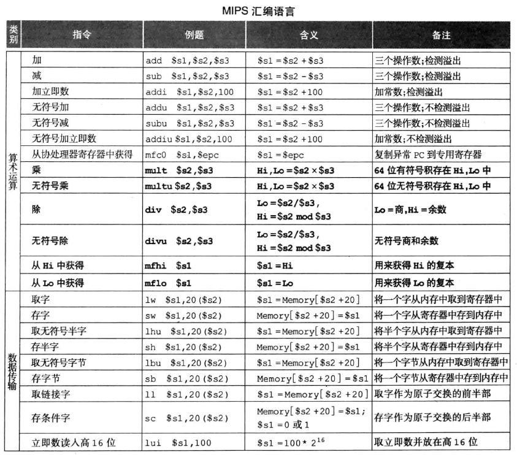
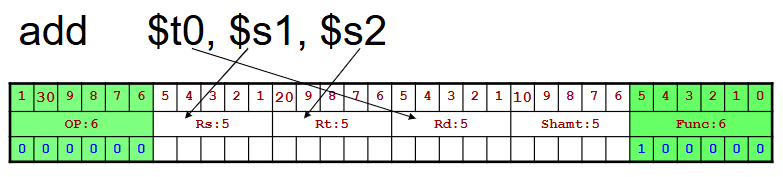
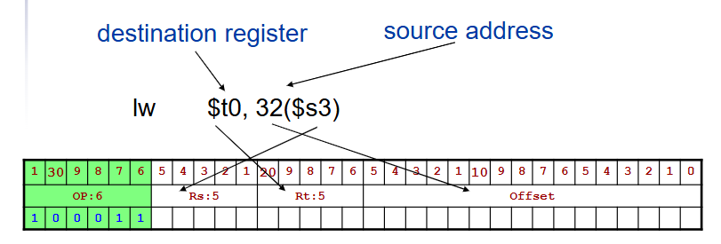
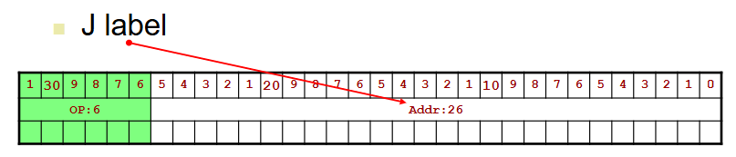
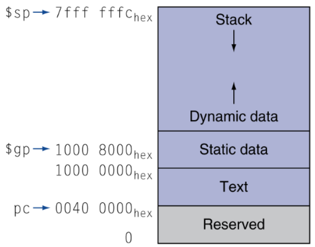

# MIPS 汇编


### 指令格式

- **R型指令**：两个操作数和结果均在寄存器中。
- **I型指令**：一个寄存器和一个立即数，包括加载、存储和条件分支。
- **J型指令**：无条件跳转。

### 设计原则
1. 简单性优先
2. 小型更快
3. 使常见情况快速
4. 良好设计需要良好妥协

### MIPS 汇编
MIPS 指令集按功能分类，主要包括：

#### 算术运算指令
- **`add`**：加法（有符号溢出检测）。
- **`sub`**：减法（有符号溢出检测）。
- **`addi`**：带立即数的加法。

#### 逻辑运算指令
- **`and`**、**`or`**、**`xor`**：按位运算。
- **`sll`**、**`srl`**：位移运算。

#### 数据传送指令
- **`lw`**：从内存加载字。
- **`sw`**：将字存储到内存中。

#### 比较与条件跳转指令
- **`beq`**、**`bne`**：条件跳转指令。
- **`slt`**、**`slti`**：小于比较。

#### 跳转指令
- **`j`**、**`jal`**：无条件跳转和函数调用。
- **`jr`**：跳转到寄存器指定的地址。

#### 系统调用指令
使用 **`syscall`** 触发系统调用。

### 伪指令
伪指令简化汇编编写，汇编器将其翻译为实际机器指令：
- **`li`**：加载立即数。
- **`move`**：寄存器值赋值。
- **`la`**：加载地址。

### 流控制
1. **分支语句**：使用条件跳转实现逻辑。
2. **循环语句**：使用分支和跳转构建循环。
3. **函数调用**：管理参数传递与返回值。

### 寄存器使用的约定
* ```$a0-$a3```:存放参数(arguments)，但是超过四个就只有放栈里了
* ```$v0,$v1```:结果值
* ```$t0-$t9```:存放临时变量(temporaries)，过程中可以覆盖
* ```$s0-$s7```:存放保存的结果(saved)
* ```$gp```:静态数据的全局指针(global pointer)
* ```$sp```:栈指针(stack pointer)，指向栈顶，但其实视觉上在最下方
* ```$fp```:帧指针(frame pointer)，指向上一个子程序栈的末尾，在最上方
* ```$ra```:返回地址(return address)

### 内存分布


### 注意事项
1. 块思想：明确入口和出口。
2. 复用思想：引入形参，超过四个参数用栈传递。
3. 恢复思想：函数应计算返回值，但不应产生负面影响。

### 寻址方式
#### PC register
在MIPS架构中，PC（Program Counter）寄存器是一个重要的寄存器，它用于存储当前正在执行的指令的地址。每次指令执行后，PC寄存器会自动更新，以指向下一条将要执行的指令的地址。在正常的顺序执行下，PC寄存器会在每次执行一条指令后递增4个字节（因为MIPS指令长度是固定的32位，也就是4个字节），指向下一条指令的地址。当遇到跳转（如```j```、```jal```）或条件分支指令（如```beq```、```bne```）时，PC寄存器会更新为跳转目标地址，而不是简单地递增。

#### 跳转距离计算
##### 相对跳转指令(如```bne```和```beq```)
**指令格式**：相对跳转指令使用16位的偏移量，表示相对于当前PC寄存器的偏移。
**计算方法**：偏移量是一个带符号的16位数，表示的是偏移的指令数。由于每条指令占4个字节，实际跳转的字节数是偏移量乘以4。偏移量是基于当前指令地址的下一条指令（PC+4）计算的，因此目标地址为：目标地址=PC+4+(偏移量×4) 这里的偏移量为带符号值，因此可以向前或向后跳转。

##### 绝对跳转指令（如 ```j```和```jal```）
**指令格式**：MIPS使用26位地址字段。目标地址字段与PC的高4位组合，形成32位的绝对地址。
**计算方法**：绝对跳转的目标地址是在当前PC地址的高4位（PC+4）和目标地址的低26位合并形成的。因此，跳转的实际地址为：目标地址\=(PC+4)31:28​∥(目标地址×4) 这里，“| |”表示位拼接操作，目标地址中的26位字段在合并之前先乘以4（即左移2位），以保证指令地址的对齐。

### RISC 设计风格的主要特点
1. 简化的指令系统，指令少，长度一致
2. 以RR方式工作，除Load/Store指令可访问内存外，其余指令都只访问寄存器
3. 指令周期短，以流水线形式工作