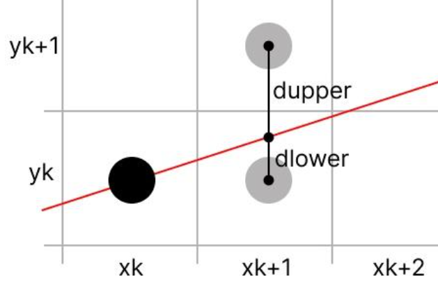
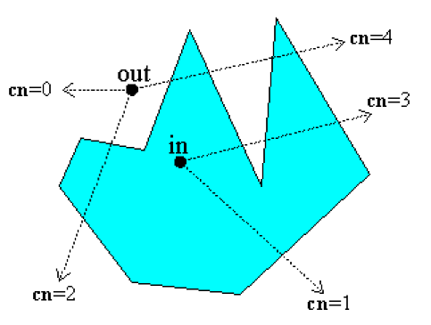
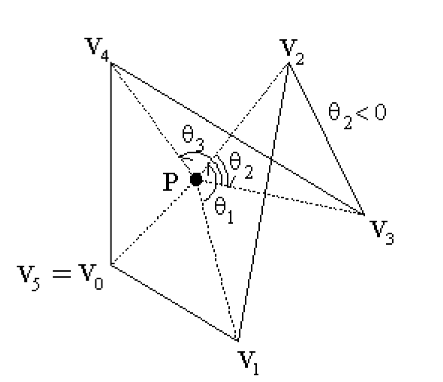
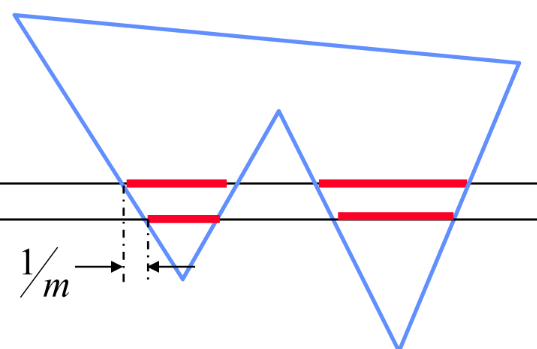

# 直线绘制
## 常规直线绘制
### DDA 算法
DDA(Digital Differential Analyzer)算法是图形学中最简单的直线绘制算法，假设直线斜率绝对值小于1，以x为主方向，根据直线方程$y=kx+b $可知，每当x增加1,y就会增加k，因为斜率绝对值小于1，所以y每次增加不足1，如果斜率大于1，就以y为主方向，计算出来的结果最后取整，就可以得到需要绘制的点。
```
x = x0 + n
y_actual = y0 + kn
y_draw = [y_actual]
```

### Middle line 算法
$F(x,y)=Ax+By+C=0$，根据线性规划的知识，将点代入方程，如果大于零，应该在直线上方，等于零在直线上，小于零在直线下方，我们的判断条件是$d_k=F(x_k+1,y_k+0.5) $，其实是在判断上下哪个点离直线更近，有$$y_{k}=\begin{cases}
    y_i + 1\qquad d_i<0\\
    y_i\qquad d_i\geq 0
\end{cases} $$

其实这个就是Bresenham，因为如果把斜率用$\frac{\triangle y}{\triangle x} $替换，你最终可以得到类似的递推

### Bresenham 算法
浮点运算是有误差的，我们应该尽量设法避免，考虑这样一个问题，直线上的点算出来是一个浮点数，介于两个整数之间，那么我们到底取哪一个呢？显然取更接近的那个，因为我们需要对比dupper和dlower



推导如下：
1. 假设直线方程为$y=kx+b$，则$du=y_k+1-kx_{k+1}-b $，$dl=kx_{k+1}+b-y_k $，接下来对这两个距离作差$d_k = dl - du =2kx_{k+1}-2y_k+2b-1=2kx_k+2k-2y_k+2b-1$，这里的$y_k $是最终取的绘制点的纵坐标
2. 将$k=\frac{\triangle y}{\triangle x} $代入并乘上$\triangle x $可得$p_k=2\triangle yx_k+(2k-2y_k+2b-1)\triangle x $
3. 如果$d_{k-1}\geq0 $,即$p_{k-1}\geq0 $那么$y_{k}=y_{k-1}+1 $，否则$y_k=y_{k-1} $，可以得到$d_k$的递推：$$p_k = \begin{cases}
    p_{k-1} + 2(\triangle y-\triangle x)\qquad p_{k-1}\geq 0 \\
    p_{k-1} + 2\triangle y\qquad p_{k-1}<0
\end{cases} $$
4. 起始点是在直线上的，所以可以代入直线方程，有$p_0=2\triangle y-\triangle x $

其实Bresenham算法亦可用于曲线绘制，曲线绘制还可以用插值和逼近

## 判断点于多边形的关系
### 射线法
从带判断的点任意引出一条射线，当且仅当射线与多边形的交点个数为奇数个时该点在多边形内部，反之则在外部。但是有很多特例，比如引出的射线与多边形的某一条边重合了，或者刚好经过了顶点，这里不展开说明。



### 角度和法
当且仅当一个点在多边形内，它与所有顶点顺次连接形成向量的夹角之和为$2\pi$，计算夹角用点乘实现。


## 多边形绘制
### 扫描线填充
对于每一条扫描线(与x轴平行)，找到它与多边形的所有交点，然后在按照x坐标排序后的交点序列中，填充每一对相邻交点之间的所有点。



### 种子填充
选取一个种子点，即多边形内一点，然后从这点逐步向四周搜索，填充所有满足条件的点知道直到无法扩充为止。