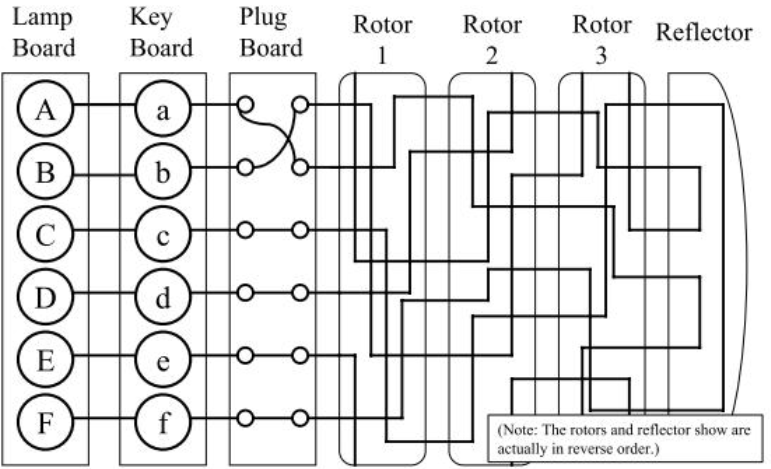
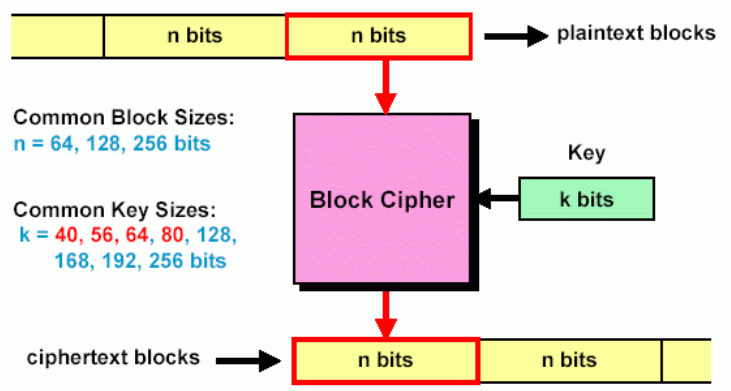
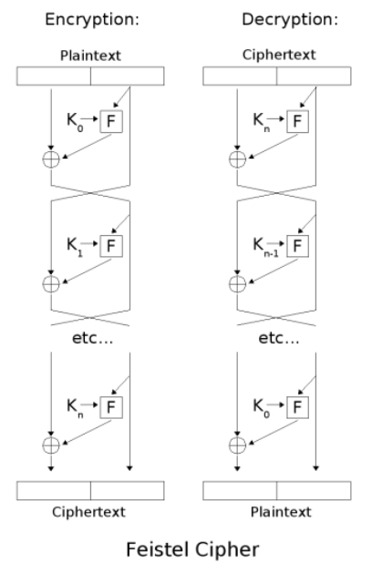
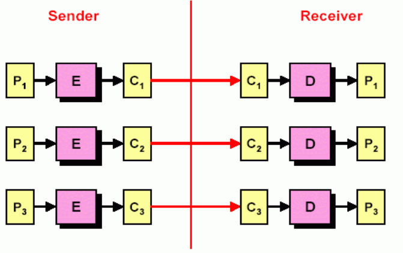
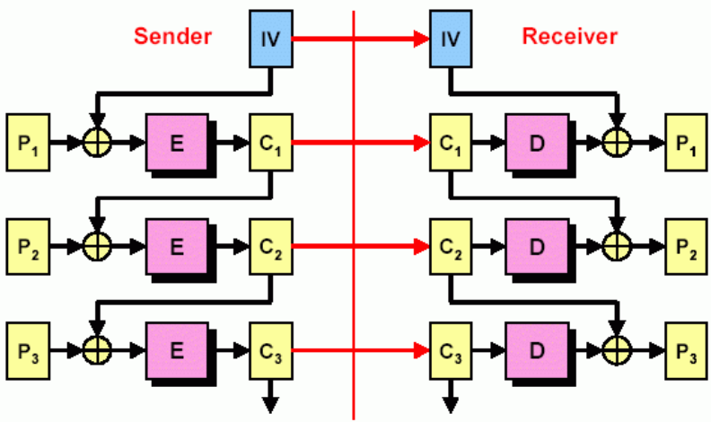
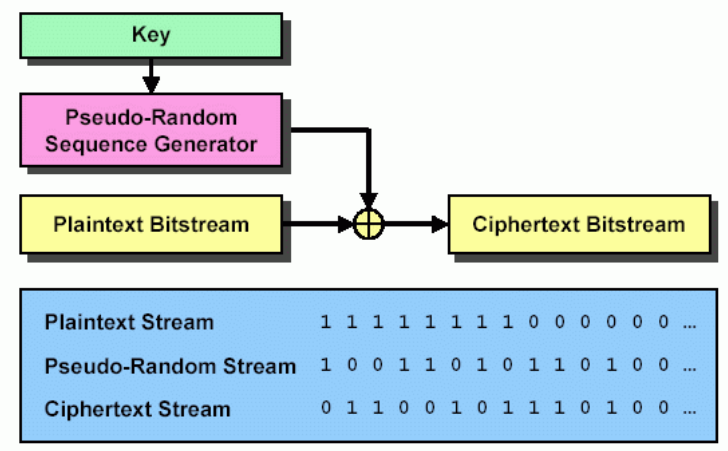

# 密码学
## 古典密码学
古典密码学的基本加密方案只有移位和替换，随着计算机时代的到来，破译古典密码基本是轻而易举，古典密码时代后期其实也出现过希尔密码这种与线性代数结合的密码。

### Caesar Cipher
凯撒密码本质是简单的移位，秘钥空间仅有25，可以选择直接爆破，也可以选择词频分析，因为移位前是同一个字母，移位后也一定是同一个字母。英语中出现频率最高的字母为E，T，A。

### Vigenere Cipher
维吉尼亚密码本质是一种多表替换加密，秘钥是一段字母序列，作业和考试很有可能是有意义的单词，注意一下秘钥中的`A`代表移位为0，破解维吉尼亚密码要稍微麻烦一点：
* 要先找出重复出现的序列，然后取它们间隔的最大公约数，这个值往往是秘钥长度，原因是重复的序列很有可能明文就是相同字母，然后用了相同的移位（对应秘钥的同一个位置）
* 然后按照秘钥长度分组，每组分别进行词频分析，因为每一组相当于退化成了单表加密，随着破译出的位数增加，再去原文中按照单词的含义比对，直到得到最终结果

<del>其实有更系统性的基于统计学的算法</del>

## 机械密码
在前计算机时代机械齿轮构成的密码最成功的当属ENIGMA，恩格尔玛机主要由五部分组成：
* lamp board 灯板：用于显示加密结果
* key board 键盘：用于输入待加密内容
* plug board 插线板：用于对调6对字母
* rotor 转子：每个转子都是一个替换加密
* reflector 反射器：反射电流，使加密和解密过程一致



下面我们来计算一下组合数，高中排列组合的知识（

* 首先这里有三个转子，一共就有$26*26*26=17576 $种可能，然后转子位置可以替换，有$A_3^3=6 $种排列，转子总的可能数为$6*17576=105456 $，这个数字并不是特别大
* 然后是插线板，如果是一对字母，那么就是$C_{26}^2 $，两对则为$C_{26}^4C_4^2/2 $，这个理解为先选4个字母出来配队，然后两两一组（分组分配），除以2是因为会有两种重复，同理如果是6对则有$C_{26}^{12}*C_{12}^2*C_{10}^2*C_8^2*C_6^2*C_4^2/6!=100391791500 $种可能
* 然后我们把上面两种组合起来，就有$10^{16} $数量级种可能性，这个数目在前计算机时代是非常吓人的

那么恩格尔玛又是如何被破译的呢？

* 首先是间谍活动，知晓如何使用恩格尔玛机并复刻出物理结构
* 然后是德军的误用
  * 德军每天所有人会统一使用day key，用day key加密message key（三个字母），并把加密后的message key并在加密文本之前发送，考虑到传输过程中可能的异常，他们把加密的message key重复了两遍
  * 那么就相当于知道了相同明文对应的密文，比如第一位与第四位对应，在有足够多的对应关系之后，我们可以把每一位的对应关系串成循环链，可以证明链的长度仅取决于转子的配置而和插线板的配置无关
  * 这样就忽略了插件版的影响，搜索空间就是rotor的10564种，然后打表，下次再遇到就直接根据链的长度查表，然后遍历可能得rotor组合
  * 因为rotor并不会影响到所有字母，把密文输进去解密，结果中的某些短句/单词或许刚好有一两个字母发生了替换，可以借此一对一对地判断出插线板的配置
* 但是后来德军改进了ENIGMA，增加了转子和插线板，也很快不再发两次秘钥，不过Alan Turing最终还是解决了这个问题：
  * Enigma 有一个缺陷，一个字母加密之后一定不是本身，可以借此来进行排除
  * 德军会发送一些固定信息，比如每天早晨发送天气wetter，天气这个词本身是已知包含在密文中的，可以根据上面那个缺陷对比出这个词在哪，在拿到足够多的词后又可以连出字母链
这里举一个最简单的例子，比如B和X构成闭环
```
一个示例：
B --> plug --> V1 --> rotor --> V2 --> plug --> X
--> plug --> V3 --> rotor --> V4 --> plug --> B
```
根据plug的性质，可以判断V2和V3是相等的，因为它们都和X对应，那么`V1 --> rotor1 --> V2 == V3 --> rotor2 --> V4==V1`，我们可以知道存在一个字母V1在经过两次rotor后会变回本身，插线板的影响又被消除了，接下来只需要遍历能够满足条件的rotor组合即可，虽然这种组合未必唯一，但是可以多条链一起得出最终结果

## 计算机时代
### 对称加密
对称加密是指加密和解密使用的是同一个秘钥（或者是实际可以互推的两个秘钥），信息的共享者都得有权限获取秘钥是对称加密的最大的缺陷（秘钥本身应该如何传递？

#### 块加密
n bits 叫做一个块，一次性对整个块加密就叫做块加密，不同块加密应该没有依赖关系，并且加密结果应该充分利用n bit的原文和k bit的秘钥，理想的随机映射秘钥需要$n*2^n $位



#### Feistel 加密结构
Feistel 提出加密算法要满足雪崩效应，主要方向有两个：
* 扩散：密文和明文的关系要尽量复杂，明文中的一位变动要影响密文的多位
* 混淆：密文和秘钥的关系要尽量复杂，即使有密文也无法获取秘钥

加密大概步骤如下：
* 右半部分用子密钥经循环函数F加密后与左半部分异或作为新的右半部分
* 然后右半部分直接作为新的左半部分
* 重复这个过程任意多次

解密就把这个过程反过来，因为一个数异或两次同一个数会得到这个数本身



#### DES
DES块的大小是64 bit，秘钥长度是56 bit（实际当中其实是64bit，剩下的8位可以作为校验位），这门课并不会讲具体如何得到子密钥和循环函数如何设计。

DES对于如今的计算来说太弱了，56位密钥太短了，所以设计出了三重DES，$C = E_{k_3}[D_{k_2}[E_{k_1}[P]]] $，至于为什么是三重？答案为了兼容旧的DES，如果加密和解密用相同秘钥就会抵消掉操作。三重DES秘钥长度差不多是3*56=168，对于今天来说也是足够的。不过三重DES的缺点也是有的：
* 计算的太慢
* 块的大小只有64 bit

#### AES
块的大小是128 bit，秘钥长度可选128/196/256 位，AES免疫目前任何已知的攻击手段，这门课也不讲细节。

#### 分组加密模式
上面的加密算法是针对单个块的，但是要怎么针对多个块进行操作才比较合理呢？下面来讨论这个问题

##### EBC
直接对每个块进行相同的操作，好处是可以并行，缺点是固定明文会生成固定密文，攻击者完全可以从密文猜出明文并打表，并且可以据此实现重放攻击，比如攻击者认为这个块代表金额为20$，然后替换一个先前得到的100$的加密块上去



##### CBC
后文是依赖于前文的，哪怕前后有相同的明文块也不会加密出相同结果，有效阻止了重放攻击和密码表构建，因为上一次得到的表示100$的加密块对应的明文在这次加密后大概率就完全不一样了



#### 流加密
每一位都对随机数异或



## 非对称加密
秘钥分发在对称加密里是个大问题，一般使用KDC（秘钥分发中心）解决，但其实这样还是不太好，比如A和B要直接通信该怎么传递秘钥？

非对称加密由此而生，非对称加密涉及到一对公私钥，核心目标是找到一个单项函数，正向计算式容易的，反向计算是困难的，其实是为了保证：
* 生成秘钥对是容易的
* 发送方加密和接收方解密都是容易的
* 通过公钥推出私钥在技术上是不可能的
* 只有公钥和密文也是无法解密的
* 公私钥可以交换，这样既可以加密又可以签名

### DH 算法
DH 算法本质上是秘钥协商算法，DH算法基于离散对数

$A=g^a\quad mod\quad p $，其中$g $是$p $的原根，所谓的原根就是$g$从1到(p-1)次方对p取模都是不同的数，即包含了1到p-1的所有数，$a$是$A$的离散对数，已知$a,g,p $求$A $是很快的，直接快速幂，因为取了模不用担心溢出，但是反过来用$A $求$a $就很困难，遍历的话扫一遍1到p-1，但p是一个三百多位的数，所以我们得到了一个单向函数

证明一个引理：$g^{ab}\quad mod \quad p = (g^a\quad mod \quad p)^b\quad mod\quad p = (g^b\quad mod \quad p)^a\quad mod\quad p $，很好证，只需要令$g^a=np+i $

秘钥选定的过程大概是：
* 选定一个大素数p，求出它的原根g
* A选定秘钥a，计算公钥$A = g^a\quad mod\quad p $，B同理选定一个秘钥b，计算$B = g^b\quad mod\quad p $
* 发送自己的公钥，然后A计算$k=A^b\quad mod\quad p=g^{ab}\quad mod\quad p=B^a\quad mod \quad p $，这个k就是A和B两个人协商的秘钥（session key）

注意p,a,b都需要大，但是原根g只需要取2,3,5这种（一个数的原根不唯一

DH算法会遭受中间人攻击，有一个C冒充了B与A对话，冒充A与B对话

### RSA 算法
RSA的单项函数是大素数乘法，两个大素数相乘是很容易的，但是反过来分解质因数，常规实现时间复杂度是$O(\sqrt{n}) $，但是n很大，所以$\sqrt{n} $也是不可接受的

欧拉函数$\phi(n) $表示的是小于n的与n互质的数的个数，它有如下性质：
* 当n时质数时，显然有$\phi(n)=n-1 $
* 如果n是一个合数，那么先对n进行质因数分解$n=\Pi p_i^k $，它的原根为$\phi(n)=n*\Pi(1-\frac{1}{p_i}) $
* 如果p和q互质，那么$\phi(pq)=\phi(p)\phi(q) $，特别地如果p不等于q，那么$\phi(pq)=(p-1)(q-1) $

费马小定理：如果$gcd(a,p)=1 $，则$a^{p-1}=1\quad mod\quad p $，这个离散学过，这里我们有它的扩展——欧拉定理：$a^{\phi(p)}=1\quad mod\quad p $，条件还是a和p互质，证明方法如下：
1. 根据欧拉函数的定义，我们可以列出所有小于n并与n互质的数$a_1,a_2,...,a_{\phi(n)} $
2. 假设有一个数c是与n互质的，那么c一定在上述序列中，那么存在$c*a_i=a_j \quad mod\quad n $，理由是c和$a_i$都与n互质，那么乘起来也应该与n互质，所以仍然在序列中
3. 如果$c*a_i=c*a_j\quad mod \quad n $，那么$a_i=a_j $，因为c与n互质，所以是可以用消去律的
4. 所以我们考虑构造一个集合$c*a_1,c*a_2,...,a*a_{\phi(n)} $，因为根据第三点，新的集合里面的每个数一定是不等的，然后根据第二点，这些数都与n互质，根据欧拉函数定义这个新集合只能是等于旧的集合（不过还要mod n）
5. 因此我们得到等式$\Pi c*a_i=\Pi a_i\quad mod\quad n $
6. 左右都是$\phi(n) $项相乘，然后$\Pi a_i $与n互质，所以可以约去，最后就剩下$c^{\phi(n)}=1\quad mod\quad n $

加密过程如下：
1. B选择两个大素数p和q，计算n=pq
2. 找到e和d使得$ed=1\quad mod((p-1)(q-1)) $，这之后p、q就没用了，可以直接销毁，(e,n)是公钥，(d,n)是私钥
3. 假设带加密的数为m，A用B的公钥计算密文$c=m^e\quad mod \quad n $
4. B接收到密文后用自己的私钥解密$m=c^d\quad mod \quad n $

证明的话只需要考虑证明$m^{ed}=m\quad mod \quad n $
1. 如果m和n互质，那么因为$\phi(n)=\phi(pq)=(p-1)(q-1) $，$ed=h((p-1)(q-1))+1=h\phi(n)+1 $，根据欧拉定理易得$m^{ed}=m\quad mod \quad n $
2. 如果m和n不互质:
   * ed = 1 mod (p-1)(q-1) => ed = 1 mod (p-1) && ed = 1 mod (q-1) => ed = k(p-1) + 1 或者 ed = k(q-1) + 1
   * 假设m不是p的倍数，那么$m^{ed}=m^{k(p-1)+1}=(m^{(p-1)})^km=m\quad mod \quad p $
   * 假设m是p的倍数，那么$m^{ed}=0=m\quad mod \quad p $
   * 综上$m^{ed}=m\quad mod \quad p $恒成立，同理$m^{ed}=m\quad mod \quad q $恒成立
   * 因为p和q互质，所以$m^{ed}-m $可以被$pq$整除
3. 综上所述$m^{ed}=m\quad mod \quad n $得证

#### 攻击方式
想要攻击RSA，假设你可以弄到公钥(e,n)和密文c，那么你有三条路可以选择：
1. 弄到私钥，emm，这个已经不是密码学的问题了
2. 直接正向爆破m，但是由于n很大，几乎不能在有效时间内完成
3. 尝试爆破私钥，也就是求d，使用等式$ed=1\quad mod \quad (p-1)(q-1) $，问题其实是分解质因数，将n分解为p*q，大的质因数分解目前也不可能在有效时间内完成
4. 虽然想要破解原文几乎是不现实的，但是还是可以尝试中间人攻击

### 数字签名
如何证明你是你？这里的方法是用自己的私钥加密，然后接收者用你的公钥解密，因为其他人是不可能用你的私钥来加密信息的，这就是最前面要求公钥私钥可以互换的好处。