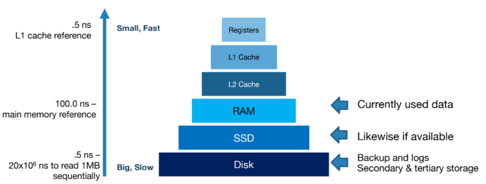
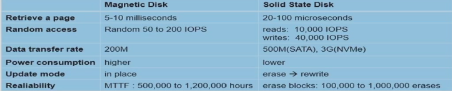
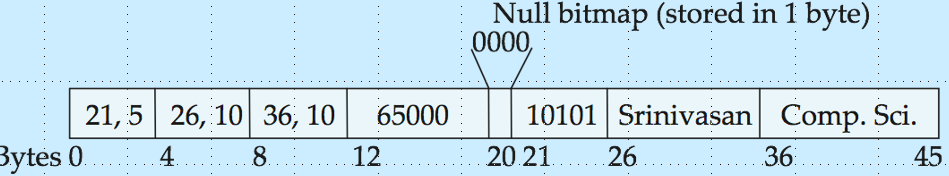
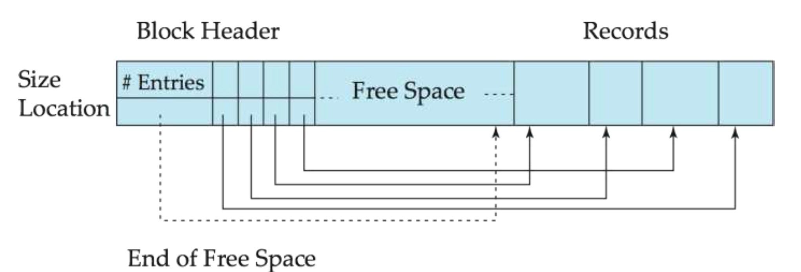
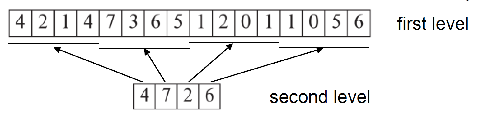
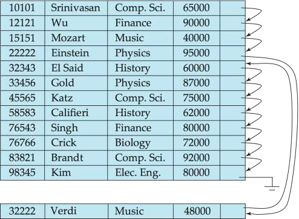
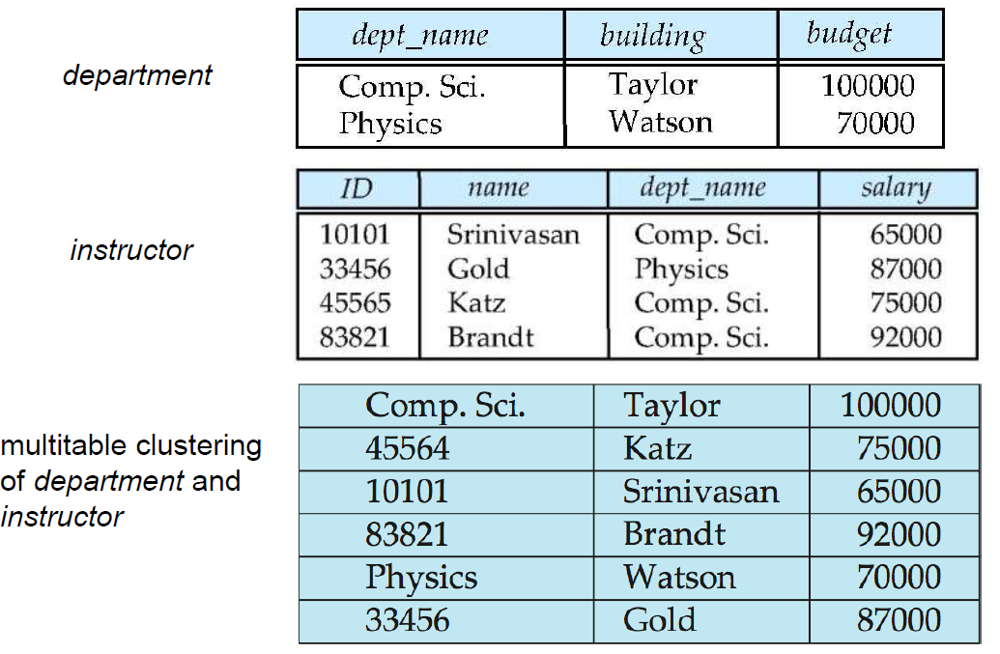
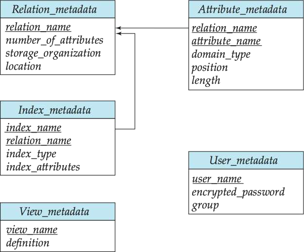

# 物理存储和文件组织

## 物理存储

!!!note
    这部分和计算机系统原理课程教授的内容重合。

### 分类

可以根据掉电后数据是否会丢失分为易失性存储和非易失性存储，然后大概的层级是：

1. primary storage 主存储器
   1. cache 高速缓存
   2. main memory 主存
2. secondary storage 辅助存储器
   1. flash memory 闪存 SSD
   2. magnetic disk 磁盘 HDD
3. tertiary storage 外部存储器
   1. optical disk 光盘
   2. magnetic tapes 磁带

1~3是易失性存储，剩下的是非易失性存储

固态硬盘内部使用闪存来存储数据，但提供和磁盘类似的接口，允许以块为单位来存储或检索数据。

!!!warning
      page 和 block 在磁盘中是等价的，但是在 SSD 中，page 指的是 NAND Flash 的页，block 指的是 NAND Flash 的擦除块（一个擦除块会包含128到256个页）。

### 磁盘

#### 基本概念

* 读写头 Read-write Head
* 磁道 tracks
* 扇区 sector 通常是512 bytes
* 磁轴 head-disk assembilies
* 柱面 cylinder 所有盘片的读写头应该位于同一磁道

#### 开销分析

* 访问时间：
  * 寻道时间 2~20 ms
  * 旋转延迟 5~10 ms
* 数据传输率 50MB~200MB

数据传输的最小单元是block，通常包含好几个扇区，也可以叫做 page

* 顺序访问：连续的请求是针对连续编号的块
* 随机访问：请求的块是任意的，每次都要寻道

最后还有一个概念 平均故障时间(Mean Time To Failure MTTF)，这是磁盘可靠性的度量指标，即可以无故障工作的平均时间，但是这是针对一张新的磁盘而言的。

#### 优化

* Buffering 在内存中缓存
* Read-ahead(Prefetch) 把之后要用的块预先取出来
* Disk-arm-scheduling 电梯算法
* file organization 把一个文件的内容尽可能放在一起
* nonvolatile write buffer 非易失性写缓存，先写到非易失性的RAM
* log disk 先写日志，之后再更新，和nonvolatile很像

### 闪存

有两种类型的闪存，即NOR 闪存和 NAND 闪存，这里主要介绍 NAND Flash，SSD即使用 NAND Flash。

* NAND Flash的读写操作以“页（Page）”为单位（通常几KB），而擦除操作则以“块（Block）”为单位（通常几百KB）。在写入数据之前，通常需要先擦除整个块。
* 一个闪存页能被擦除的次数有限，所以需要进行磨损均衡(wear leveling)，把擦除操作均匀分布：把物理页映射到逻辑页(remapping)，看起来是在对同一页更新，但实际上是在对不同的页更新。
* SSD 支持并行的随机访问，这是 HDD 做不到的。

## 文件组织

数据库被存储为一系列的文件(可能是由操作系统维护)，每个文件被组织成一系列的record，每个record又被组织成一系列的field。要求不存在比块更大的记录，没有一条记录是包含在多个块中的。

### 基本存储方式

#### 定长存储

每个record的长度是固定的，这样可以像数组一样访问。删除有三种方式：

1. 依次前移，这个在学C的数组时就知道是开销很大的
2. 把最后一个移过来
3. 不移动，维护一个 free list，通常插入比删除更加频繁，所以可以让新插入的记录用上删除的空闲空间。

#### 不定长存储

有多种可能导致不定长：

1. 一个文件中存了多种类型的记录
2. record 本身有可变长的类型，比如`VARCHAR`
3. record本身允许重复的域，比如数组或者多重集合

方法是记录不定长属性的*偏移*和*长度*，然后在所有定长记录之后存储不定长属性的实际值，空的属性可以用null bitmap表示，下图中前三个属性是不定长的，最后一个属性是定长的。**注意，null bitmap书上认为值为 1 才是代表为空**。

上面是一条不定长的记录，然后为了存放不定长的记录，引入了分槽页(slotted-page)结构，每个块开头存放元数据：

* 记录的数量
* 自由空间的末尾处
* 每条记录的位置和大小组成的数组

这部分的详细算法在 minisql 的 record manager中有实现：

1. 插入：在自由空间末尾插入并修改元数据
2. 删除：在元数据中标记删除，然后在自由空间中移动记录填补空缺，末尾指针也要改

### 优化

#### 堆文件

record可以被塞在任何有空闲空间的地方，在分配内存后通常就不再移动了，记录是没有顺序的。这样的话如何找到空闲空间就很重要，显然不是去线性搜索：可以用一个 自由空间图(free-space map)记录一个block有多空闲，通常是一个数组，比如用3个bit表示空闲程度0~7，7代表着至少有$\frac{7}{8} $的空间是空闲的。

尽管这种扫描比实际获取块来找到自由空间要快，但是对于大型数据库来说还是很慢，可以建二级自由空间图，存储一段block的最大空闲程度。  

#### 顺序文件

整个文件的所有record都是按某个搜索键（任意属性或者属性的集合，不需要是主键或者超键）的顺序存储的，指针是为了加速查找，插入如果对应位置是空的则插到对应位置，否则插到 overflow block，无论那种情况都需要调整指针，因此需要定期重整来保证顺序。

#### 多表聚簇文件

大多数数据库系统将关系存储在一个单独的文件中，在这样的设计中，每个文件或者每个块只存储一个关系的记录。但是，把相关表的数据存到一起，能够提高 join 的效率。

上面这张图中，`department`和`instructor`被组织在了一起，先是学院的信息，然后紧跟着是这个学院老师的信息，这里甚至学院的信息只在一开始存了一次，如果查询的时候要同时查学院和这个学院老师的信息，就会很方便，但是这种情况下如果只查学院的信息，那么会很麻烦，哪怕可以用指针把学院信息连接起来，要读取的块数还是很多。

#### 划分

一张大的表可以被分成多个小的表，能够减少诸如空闲空间管理的开销，比如可以按照年份划分数据，把最近的数据存在SSD，然后往年的数据存在磁盘。

#### 数据词典存储

存储表的元数据（即关于关系的数据），存储在系统目录(system catalog)中，即 minisql 的 catalog manager，必须存储的属性有：

* 关系的名称
* 每个关系中属性的名称
* 属性的域和长度
* 在数据库上定义的视图名称以及这些视图的定义
* 完整性约束

实际上，这些元信息组成了一个微型的数据库，可以存储为数据库的关系，但是注意到`index_attributes`这种会被表示为一个字符串，虽然违反了第一范式，但是这样存储数据会更有效。

只要数据库需要从关系中检索数据，它就必须通过`relation_metadata`关系来查找关系的位置和存储组织，然后使用该信息去获取记录，但是元信息本身的存储组织和位置必须被存放在其他地方（比如一个固定的位置），因为元数据会被频繁访问，所以实际上会被放在内存中。

#### 面向列的存储

把每一个属性单独存储，可以减少 IO，如果只访问某些属性的话，但是对于按照元组进行的操作会增大开销。

## 存储访问

block(page) 始终是磁盘数据访问的最小单位，buffer为了与磁盘适配，最小单位也是block(page)，buffer相当于是内存中的磁盘block，用于减少磁盘访问次数。但是由于内存有限，所以buffer在必要时需要替换，替换的策略有LRU等。

### 缓存管理

从磁盘访问数据远比从内存访问数据慢，所以数据库系统需要在内存保留尽可能多的块，因此需要对内存中存储块的区域进行管理，即 buffer manager。

buffer manager 返回的始终是内存中对应块的地址，如果内存中没有，那么需要从磁盘读取，但是如果内存缓冲区满了，那么需要根据替换策略选择一个块替换，替换的块如果为脏页（即被修改过）会被写回到磁盘。涉及的操作有：

1. pin：在读写之前完成，防止block被替换， pin 会有一个计数（如果是读的话）
2. unpin：在读写之后完成，允许block被替换，pin 计数为0则可以替换

并发访问中也会涉及闩(latch)，用法规则和lock几乎一样，这里省略。大多数恢复系统要求当块上在进行更新时，不能写回磁盘，为了满足这个要求，写回磁盘的进程需要共享锁。

### LRU

LRU(Least Recently Used)，把最近最少访问的块替换掉，实现为维护一个queue，LRU在某些情况下会很差，比如在join时循环扫描。与之相对的还有MRU(Most Recently Used)。

### clock

Clock算法是LRU的近似实现，最近使用过标记为1(在unpin时)，未使用过标记为0(在一次扫描时如果为1则标记为0，下次扫描时就可以使用了)，需要替换时扫描找到第一个0的块替换。

与操作系统不同，数据库在执行时是知道执行方案的，也就是知道不远的将来要干什么，比如都知道在做join，就肯定不应该选择 LRU。
