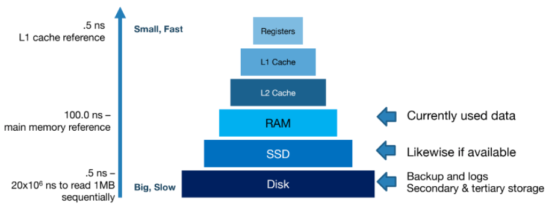
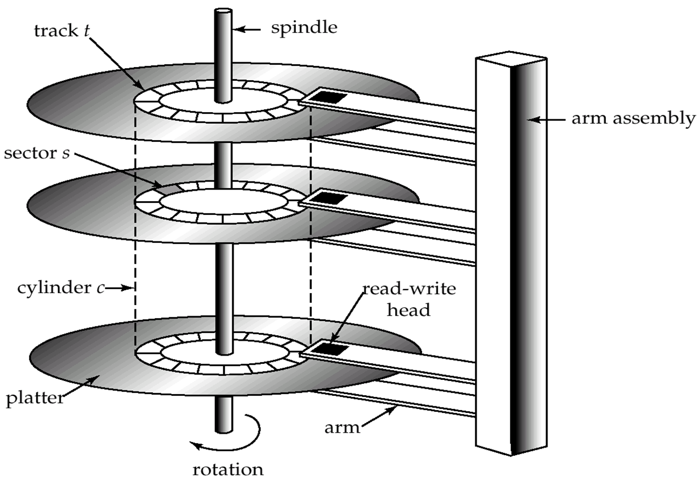
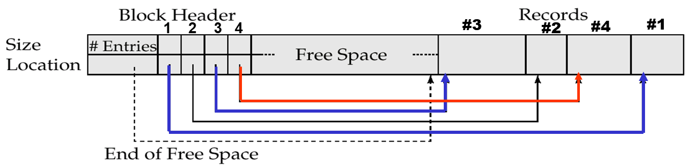
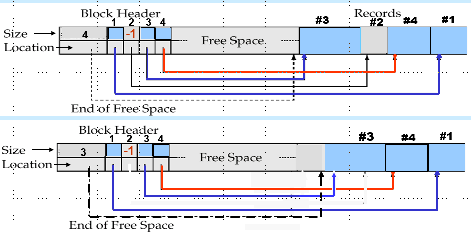
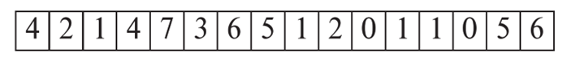
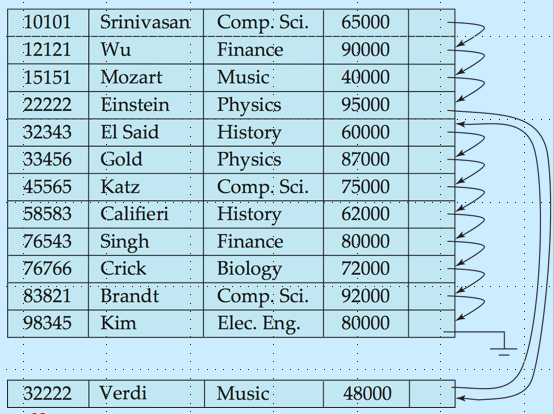

# 物理存储系统
!!!note
    这部分知识和计原重合，不管是存储器的分级，还是读写策略，因为系统的设计总是离不开硬件的。但是这部分PPT组合的真的很抽象，建议可以去看UCB的note和minisql的实验的实现

## 常见存储器介绍
!!!warning 注意区分存储介质与存储设备
    比如Cache是用SRAM实现，主存用DRAM实现，固态硬盘用Flash实现

### 存储器分级
存储器可以按易失性分为易失性存储器和非易失性存储器，非易失性存储指的是断电后数据能保存的存储器

#### 易失性存储
最接近CPU的显然是寄存器，数据库里面基本不考虑这一级别

其次是Cache（高速缓存），Cache还可以分级，L1主要是为了加快读取，L2主要是为了降低不命中的概率

然后就是main memory（主存，也就是平时说的内存），存储运行时需要的数据

#### 非易失性存储
首先是闪存，闪存是非易失性存储，常见于嵌入式设备，比如照相机，固态硬盘(SSD)是由闪存实现的,固态硬盘并不能直接覆盖原来的数据，固态硬盘必须要把旧的数据先擦出然后才可以把新的数据写入，但是擦除的次数是有上限的，所以有磨损平衡策略(wear leveling)，要避免频繁对某个区域的读写，实现为逻辑地址到物理地址的映射，所以可以漂移物理地址

然后是磁盘，磁盘可以分为多个磁道和扇区，其实到这里计算机本身的存储就结束了，不过此外还有optical-storage（光学存储，比如CD）和type-storage（磁带存储），这两个都是off-line的

### 磁盘
#### 简介
因为数据库系统的体量是很大的，所以实际会存储在磁盘当中，下面是一个磁盘的示意图，它是由很多盘片组成的，这些盘是统一转动的，每个盘上有数十万个磁道，每个磁道上又会有上千个扇区，**磁盘和计算机系统交换数据的最小单位就是扇区**

* 在执行查找时磁盘臂会先寻道（直线运动），然后磁盘再旋转（转动），这两步都是机械运动，所以相比于电子设备的操作都很慢，基本是毫秒级的时间。

* 这里有柱面的概念，把每一层同磁道组合在一起就构成一个柱面，同一个文件存储在同一个柱面可以有效降低寻道时间以及支持并行读取。

* 磁盘本身比较适合顺序访问，如果是随机访问，可以选择使用日志磁盘记录所有要读的数据再顺序地去读（电梯算法）

* MTTF（main time to fail）是磁盘不发生故障可以正常工作的平均时间，大概是3到5年

#### 优化策略
1. data is transferred between disk and main memory in blocks.数据是按块传输的
2. 磁盘臂调度按照电梯算法，先从外圈到内圈，再从内圈到外圈，安次循环
3. 要把相关数据存储在同一个或者相邻柱面，文件可能会逐渐变得碎片化，有些系统有重整机制，但是重整的时候是不允许访问的
4. 非易失性写缓冲区，因为正常情况下必须写完硬盘才能继续接下来的操作，这里选择先写到一个可以快速写的缓冲区（比如闪存），而且这个缓冲还得是非易失性的
5. 日志磁盘，写数据随机写是很慢的，但是可以把对磁盘块的修改以日志的形式存在磁盘里面，然后就可以顺序访问了

SSD VS MD

## 存储方式
数据库被存储为很多的文件（对应relation，即一张表），每个文件都是一系列记录（对应tuple，即一行），假设一个块是4kb，每条记录长度是100byte，那么一个块最多就可以放4096//100=40条记录，剩下的零头直接不要了，否则会出现同一条记录跨块的情况，反而不利于操作，这是定长的情况示例。

### 记录的存储
#### 定长存储

定长的记录管理起来比较简单，每一个域（属性）的长度都是相同的，显然第$i $条记录会从$n*(i-1) $开始，记录的访问是很容易的

删除有三种方法：
1. 直接整体往前移动
2. 把最后一个拿来填补
3. 用`free_list`管理空闲的块

第一种的操作太多，应该避免，前两种会导致顺序混乱，使用`free_list`的话，链表的头是存放在最前面，指向第一个空闲的块，删除时则往链表上添加

#### 变长存储
变长存储的需求可能来自：
* SQL里面有`varchar`这种变长的类型，如果处理为定长，会
* 存储多值属性（多值属性比如电话号码之前讲过一种不好的实现是直接把多个电话号码拼在一起）
* 有些域允许重复（感觉和多值差不多）
* 有些域允许空值，这种情况用定长同样浪费空间

属性是按顺序存储的，变长的属性是被定长的结构表示，这个结构含有对应属性的存储地址和长度`(offset, length)`，实际的变长数据存储在定长的表示之后

是否为空值使用`null-value bitmap`表示，如下图，有四个属性，所以`null-value map`用了4位，但是内存并没有办法只存储4bit，还是要存储为1byte

具体实现是分槽页(`slotted page`)结构，`slotted page header`包含记录的数目，空闲区域截止的地方(是一个指针)，每条记录的位置和大小，相当于给定了每条记录的入口

记录的编号是很重要的问题，定长的时候可以直接用块号+偏移组成一个绝对地址，但是绝对地址不利于修改，也可以选择使用块号+索引号，这样哪怕挪动块也不会影响到寻址。

这张图描述的是一个页内重整的过程，保证页内没有碎片，这里的指针是指向存储record的entry，而不是直接指向record本身的内容

### 文件块组织
数据库系统与磁盘交换数据是以块(block)为单位的，所谓的块是同一磁道的多个扇区，即使是想访问一个整数，也要取出来一整个块

#### Heap
只要有空余空间就放，记录一旦被分配空间就不再移动了，所以如何高效的找到空闲的空间就很重要，我们这里使用一个链表来记录所有空闲的片段，相当于把每个块的空闲区域给串起来了

PPT上（如下图）是用一个空闲地图表示，比如用3个bit表示有多空闲，4就表示$4/8 $空闲，参考索引那一章的内容，我们还可以设置二级索引，表示这一部分块（比如四个块一组）里面最空闲的块有多空

#### Sequencial
适合需要顺序处理的数据，记录按照(search-key)排序，插入如果有空余空间就插入，如果没有则插到`overflow-block`，不管是哪种情况都需要修改链表来维护顺序，所以需要定期重整来真正修正顺序

#### 聚合文件
把相关的表组合储存在一起，比如经常需要全连接的两张表，一个系和这个系的老师的信息存放在一起，但是这样单纯查询系就很麻烦，因为系的信息是分散的

#### 哈希文件
通过设计一个很好的哈希函数把某些属性映射到一个数值，这个值就是`block_num`，但是会发生哈希冲突，然后就又需要那些解决冲突的手段

#### Table Patition
如果一个表太大了，可以考虑分割，这样对于并行之类的操作有利，并不是死板的一张表就是一个文件

### catalog management
Data dictionary 存储着元数据，比如表的信息，用户账号信息，物理文件组织的信息。元数据同样可以以表的形式存储，比如在插入时要对插入的数值进行类型检查，所有模块其实都要和catlog打交道。

但其实也未必真的是组织成表，也可以选择组织称structure的形式

### buff management
这里的buffer是主存的一部分，也是按照block分割对应disk里面的数据库数据，要访问某个记录是会先去buffer中查找，如果找到则返回，否则才去disk读取，如果buffer中有剩余空间，则直接写入，否则进行替换

但是替换那一块就很有讲究：

这里有一些相关概念：
* `pinned block`:被钉住的块，如该块目前正在被多个事务使用，用`pin_count`记录有多少个事务在使用这个块
* `toss_immediate`：用后即舍弃
* `forced_output`：使用`dirty_bit`标记是否被修改过

#### LRU
先进先出其实不太合理，最近最少用到的估计后面也不怎么用，这是LRU的基本想法，反例是两个表做连接，这个其实是一个两重循环，对于内层循环，最近用到的反而要到下一轮才会用到，与之相对还有MRU必须被pin，但其实都太简单了，可以考虑根据数理统计的知识预测，这个世界果然是一个巨大的回归系统

#### 并发访问
读和写是冲突的，写和写也是冲突的，所以要加锁，这个详见后面的章节