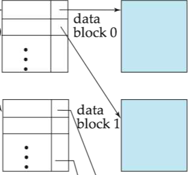
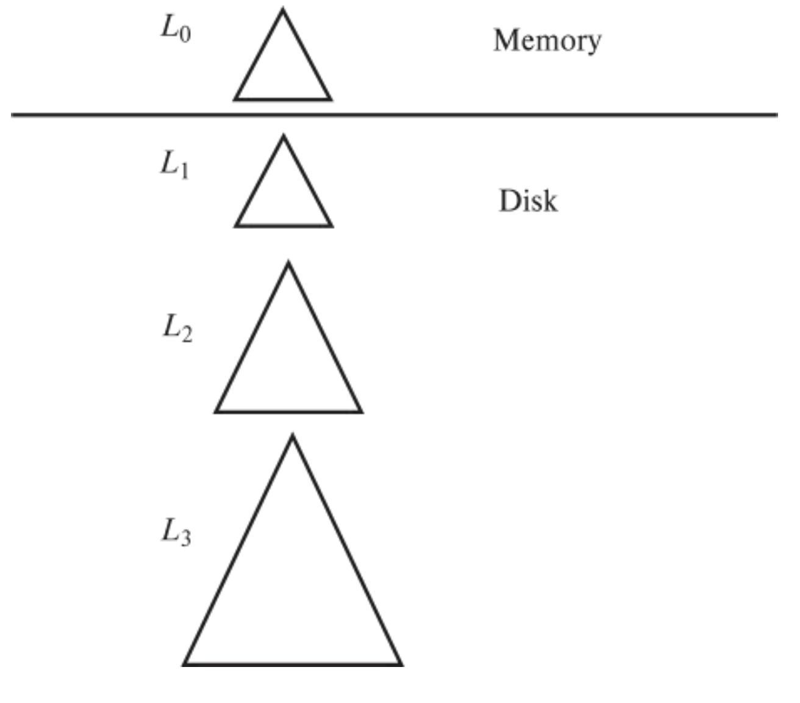
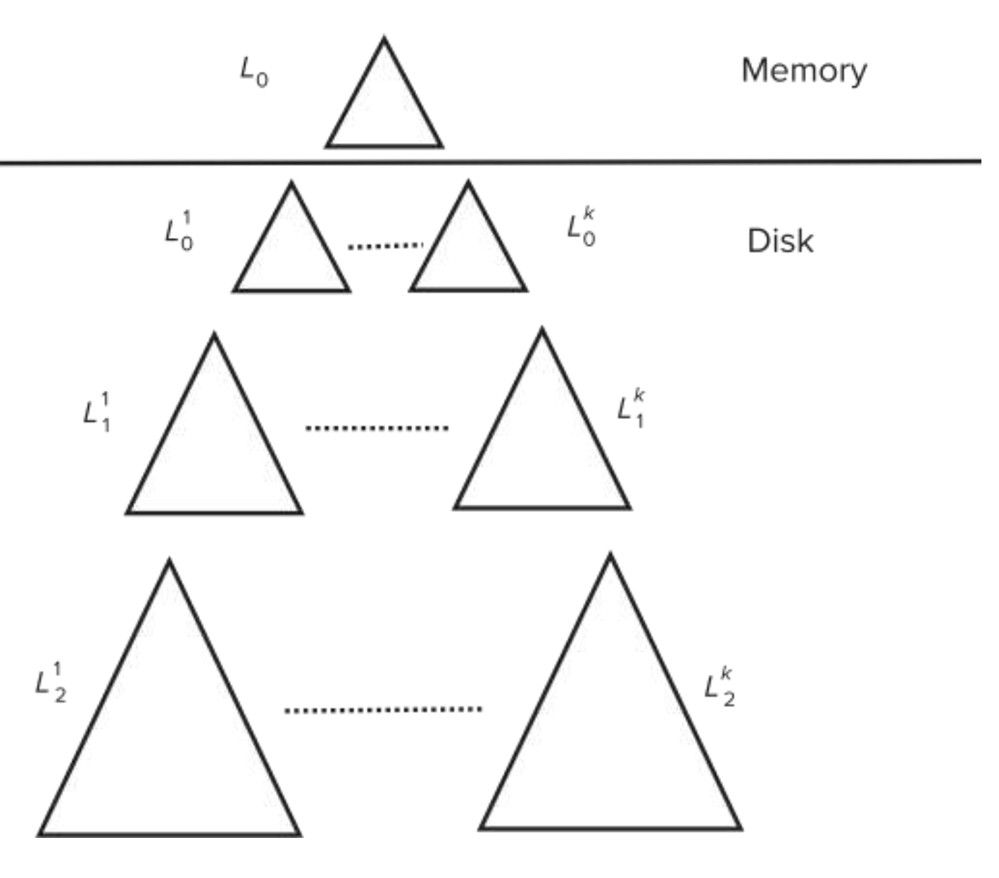

# 索引
!!!note
    基本就是ads里面的B+ Tree，可能细节上有些区别，但是插入，查找和删除的算法都是基本一样的。

## 基本概念
索引是为了加速查询，这一章我们只学B+树索引，搜索键是用于构建B+树的元素，B+树索引是顺序索引。顺序索引可以按照搜索键是否是顺序文件中的“顺序”分为主索引（聚集索引）和辅助索引，可以这么理解：主索引的搜索键等价于文件的物理地址顺序，而辅助索引的搜索键是用户定义的，所以主键的索引通常是主索引。

### 分类
* 稠密索引 dense index：每一个所有键都有索引记录
* 稀疏索引 sparse index：只有某些搜索键有索引记录，在顺序的情况下是合理的，类似于二分查找

有一个比较好的做法是给每个块的开头加一个索引，就如下图所示



### 多级索引
如果主索引放不到内存中，开销会很大，可以对主索引再建一个稀疏索引，如果还是不行可以继续加级，但是更新时所有层级必须同步更新。

## B+ 树
B+ 树是平衡的，内节点必须是$\lceil \frac{n}{2} \rceil $到$n $个孩子，叶子节点必须是$\lceil \frac{n-1}{2} \rceil $到$n-1 $个记录，其实可以统一记忆为节点数， DB课程的B+树叶子节点和内节点的结构就是统一的，不像某ads的神奇B+树，特别地，根节点不是叶子的话至少要有两个孩子，然后DB B+树的叶子节点还会再指向对应数据记录的指针（或者直接存储数据记录本身，但更常见的是指针）。

### 节点结构
B+ 树的节点结构为
```
P1 K1 P2 K2 ... Pn-1 Kn-1 Pn
```
其中$P_i$是第$i$个孩子的地址，$K_i$是第$i$个键，其他的要求和ads的B+树一样。

### 特性
* 因为内存中的关系是通过指针连接的，所以逻辑上相邻的块，物理上不一定相邻。
* 非叶子层实际上构成了一个稀疏索引
* B+树是一个扁平化的结构，树高不会超过$log_{\lceil \frac{n}{2} \rceil}(K)$，其中$K$是键的个数

### 操作
流程和 ads 讲的没什么不同，这里写一些结论：
* node的大小通常和block是一样的，通常是 4 kilobytes
* 分裂是$\lceil \frac{n}{2} \rceil $留在分裂前的节点，其余的移到新节点，新节点的父节点是分裂前节点的父节点如果父节点不满足要求则递归分裂
* 合并，是把搜索键全部移入左边的兄弟节点，并删除右边的节点，然后删除父节点的指针，如果父节点不满足要求则递归合并
* 如果搜索键不唯一，那么构造一个复合属性$(a_i,A_p) $，其中$A_p $是主键（至少是唯一的），然后搜索$a_i = v $就变成了范围搜索

### B+ 树文件组织
B+ 树文件组织是B+ 树的叶子节点构成了一个顺序文件，但是因为 record 比 pointer 大，所以叶子节点中能存的 record 树少于内节点能存的pointer 数，可以通过在分配时限制必须有更多孩子能优化空间利用率。

如果一条记录移动了，整个索引都必须被更新，分裂节点的开销变得很大，解决方法是在二级索引中使用主索引的搜索键。

### 优化构建
1. 插入前先（外部）排序，但是这样很多叶子节点半满
2. 自底向上构建，还是先排序，然后直接从叶子层开始构建

## 写优化的索引
!!!note
    这个真的会考，感觉是因为B+树考太多了（

### LSM-tree
LSM Tree(Log Structured Merge Tree) 并不是严格的树状数据结构，它是一种存储模式，核心特点是利用直接在内存中写来提高写性能，但因为分层(此处分层是指的分为内存和文件两部分)的设计会稍微降低读性能。



流程是：
1. 先写到内存中的$L_0 $
2. 如果内存中的$L_0 $满了，就将$L_0 $合并到外存中的$L_1 $，$L_1 $的合并策略是自底向上构建
3. 如果$L_1 $满了，就将$L_1 $合并到$L_2 $，以此类推
4. 每一层至少大$k $倍

删除实现为再维护一颗删除的表（相当于标记为删除），在合并时达成真正删除，更新也是先删后插。

它还可以有变体 stepped-merge index，即每一层有多颗树，进一步减小了写的开销，但是读的开销变大了。



### Buffer tree
每个内节点都有一段buffer来存储插入的信息，当buffer满了才被写入下一层。

## bitmap indices
