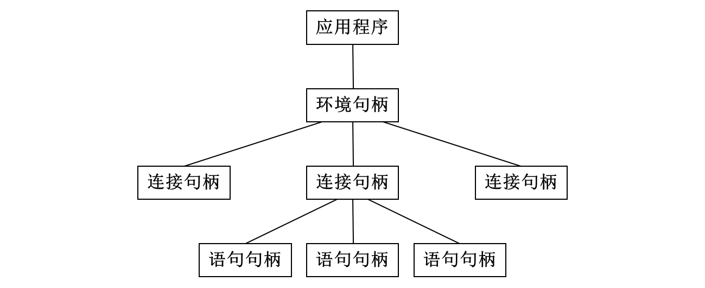
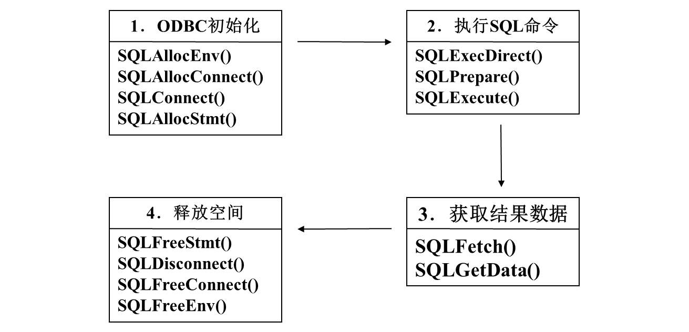

# 数据库与开发实践
!!!abstract
    因为zju的落后性，所以这门课居然都还有嵌入式 SQL，事实上现在JDBC都是过时的，在如今的开发中会使用ORM框架，比如Hibernate，MyBatis等，没有特殊理由不允许拼接SQL语句。很多年前的历年卷有考过，但是现在嘛，不好说（

SQL的功能是不完备的，或者可以说SQL不是编程语言（就是因为它不图灵完备），以及SQL的很多功能实际当中不会去直接使用，而是在外部代码中实现。

## 嵌入式 SQL
SQL 标准定义了一系列语言的嵌入式 SQL，包括C/C++，Java等，这些语言被称作宿主语言(host langauge)，可以在宿主语言中定义SQL语句，这些语句在编译之前会经过特殊的预处理器处理，预处理器会将嵌入式SQL转化为宿主语言的声明，为了使预处理器识别出嵌入式SQL，我们使用`EXEC SQL<嵌入式SQL语句>`，在嵌入式SQL中可以使用宿主语言的变量，不过必须加`:`（感觉和模版语言很像）

### 单行查询
``` C
EXEC SQL BEGIN DECLARE SECTION
char V_an[20], bn[20];
float bal;
EXEC SQL END DECLARE SECTION
......
scanf("%s", V_an);
EXEC SQL SELECT branch_name, balance INTO :bn, :bal FROM account WHERE account_number = :V_an;
END EXEC
printf("%s","%s","%s",V_an,bn,bal);
```

### 多行查询
要遍历嵌入式SQL查询的结果，必须声明一个游标变量(cursor)，感觉类似于Python或者JS中的生成器(generator)或者C++/Java的迭代器
``` C
EXEC SQL
    DECLARE c CURSOR FOR
    SELECT customer_name, customer_city
    FROM depositor D, customer B, account A
    WHERE D.customer_name = B.customer_name
        and D.account_number = A.account_number
        and A.balance > :v_amount
END_EXEC

EXEC SQL OPEN c END_EXEC

EXEC SQL FETCH c INTO : cn, :ccity END_EXEC

EXEC SQL CLOSE c END_EXEC
```

## API
### ODBC
支持的语言有C,C++,C#，ODBC 提供了一个公共的、与数据库无关的应用程序设计接口 API，ODBC是一个句柄模式的API（想到opengl了），





### JDBC
Java支持，但是也很陈旧了，可能需要用 Maven 拉取一下对应的包
``` java
try{
    Connection conn = DriverManager.getConnection(
        //填信息
    )
    // 一般不用 Statement，直接用 PreparedStatement 以防止SQL注入
    Statement stmt = conn.createStatement();
    stmt.close();
    conn.close();
}
catch{
    // ......
}
```