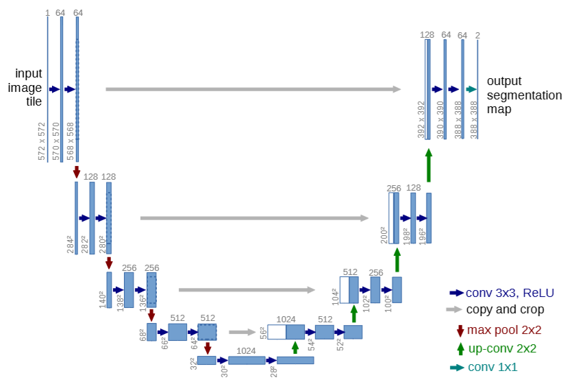
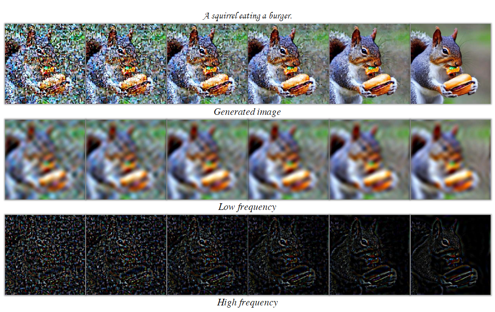
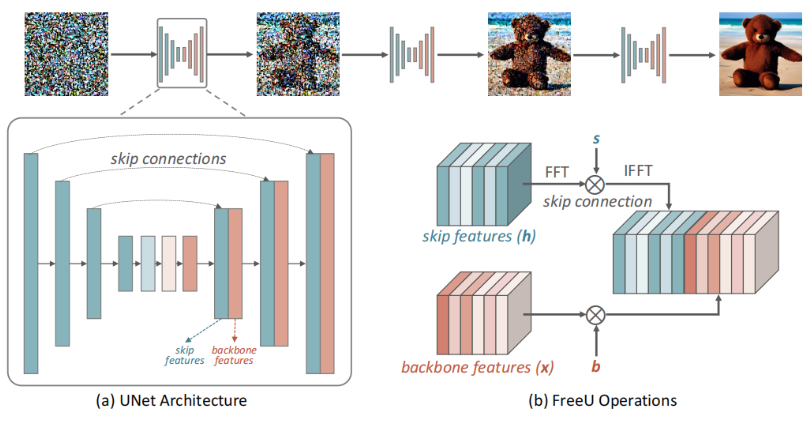
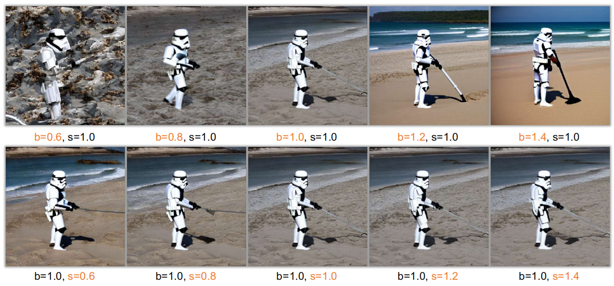
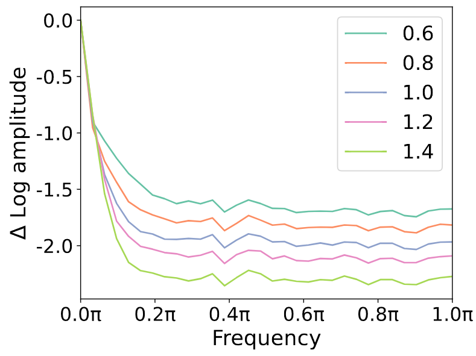

# FreeU

## 简介

长期以来对DDPM的改进集中在了逆向过程流程的调整上，比如DDIM可以跳步，但是先前没人考虑过优化UNet模型，这篇文章对UNet模型进行了一个看起来非常简单的优化，对UNet的解码过程进行了调整，核心思想是**Unet中跳跃连接的存在能贡献更多高频细节但会可能会降低去噪能力，基础连接贡献更多去噪能力，选择性提高基础连接权重并降低跳跃连接中低频权重可提高生成质量**。

## UNet

UNet 是`Encoder-Decoder`架构，结构简单而有效，它由编码器（下采样路径）和解码器（上采样路径）两部分组成，形状呈U型，因此得名U-Net。

其中，蓝/白色框表示`feature map`；蓝色箭头表示`3x3 卷积`，用于特征提取；灰色箭头表示`skip-connection`，用于特征融合；红色箭头表示`2x2池化`，用于降低维度；绿色箭头表示`2x2上采样（反卷积或者插值）`，用于恢复维度；青色箭头表示`1x1 卷积`，用于输出结果。**可以看到跳跃连接提供了进一步编码前的特征，从而有利于解码**。

## FreeU 的发现

### 低高频分量

作者发现去噪过程中低频分量和高频分量的差距，如下图所示，可以看出低频分量在去噪过程中的变化并不大，而高频分量则呈现出显著变化，从一个模糊的轮廓逐步转化为了清晰的线条。这个依据去噪过程的实质也不难理解，去噪实际上是在还原细节，高频分量正是细节的体现，低频分量则代表了图像的结构。

### Free 架构

FreeU 将跳跃连接中的直接拼接改成了按照一定权重拼接，这个权重是最终可以通过一定计算得到的，即下图中的`s`和`b`。

这篇文章探究了`s`和`b`的变化会如何影响生成图像的质量，如下图，我们可以看到`b`的变化可以很明显的影响到模型的生成质量，而`s`的变化对于图像的影响似乎没有那么大。

### 原因探讨

但是这是为什么？这里就需要结合上面的高低频分量和下图来分析，高频分量的增多提供了更多细节，会导致解码过程收敛得更快，因而可能降低了去噪能力（果推因？），而`b`的增加恰恰能够抑制高频分量。这个和想象中的结论有些差距，正常情况下可能会认为收敛越快去噪效果越好，但事实并非如此。

## FreeU 的实现

### 权重计算

`s`和`b`如何确定，这是个问题。