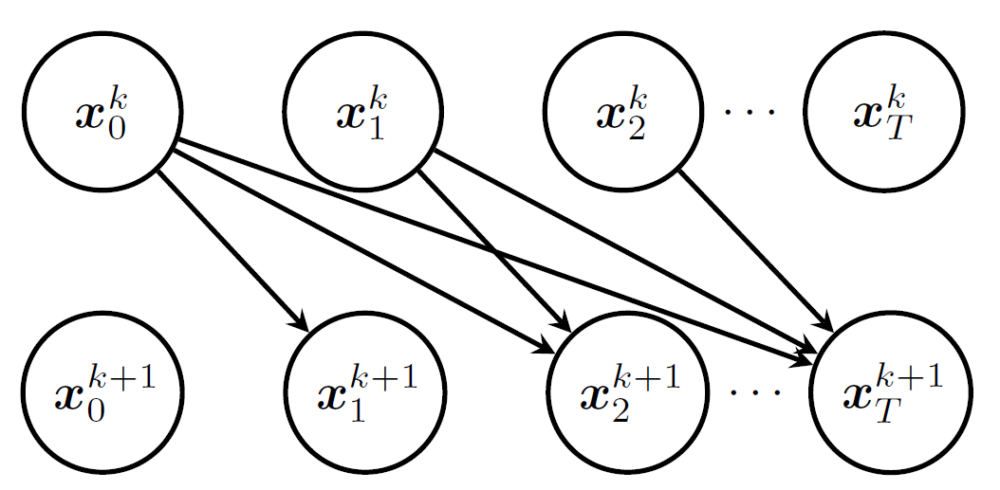

# ParaDiGMS

## 简介

扩散模型论文的背景感觉都是在讲扩散模型的发展历程，就是如何从 `DDPM --> DDIM --> 扩散 SDE --> 扩散 ODE --> DPM Solver` 一步一步演变过来的。扩散模型最大的问题就是过慢的采样，先前的方法主要是在减少采样步数，但是代价是采样质量的下降。

这篇文章的思想来源大约是既然可以用采样质量的降低换取采样时间上的减少，那么可以用计算资源换取时间上的优化吗？也就是说能否利用并行计算来加速采样？最初这个想法显得很荒谬，因为 DPM 天生来自马尔科夫链，采样固然是顺序的，最终这篇文章发现在去噪时并行是能够降低采样延迟的，基于预测采样轨迹并迭代改善结果至收敛。这是第一个允许用算力换时间的扩散模型采样方法，并且与已有的串行加速方案兼容（<del>这下可以拼好 AI 了</del>）。

## 并行计算

### Picard 迭代

#### 理论基础

这篇论文并不是要增大吞吐量(throughout)，而是要降低单步执行的时间（即降低采样延迟），步数不变，但是每一步采样变快了，比如最开始的 DDPM 要 1000 步，每一步快 1 S，那么整体就会快 1000 S，这是非常巨大的提升。但是要并行计算每一步是非常困难的，因为本身马尔科夫链过程决定了采样天生是串行的。

这篇文章最终选用了 Picard 迭代，这是一种求解 ODE 的不动点迭代方法， ODE 在反过来积分时可以有如下表示

$$x_t = x_0+\int_0^t s(x_u,u)du $$

这个式子本身是非常好理解的，这个就是牛顿莱布尼茨公式，我这里用 maybe 更微积分的语言来表述，我们手上有初值和常微分方程（回想起 NA了）

$$\frac{dy}{dx}=f(x,y)\\y(x_0) = y_0 $$

然后现在要求解这个微分方程（这个微分方程的表达式是已知的，里面既有$x $也有 $y $），也就是要解出 $y=f(x) $，对微分方程两侧从 $x_0 $到 $x $积分可得

$$y(x) - y(x_0) = \int_{x_0}^{x} f(x,y)dx $$

然后把初值带进去移项可得

$$y(x) = f(x) = y_0 + \int_{x_0}^{x} f(x,y)dx $$

迭代的步骤如下：

1. 确定迭代的初值，可以取常函数$y_0(x)=y_0 $
2. 然后代入迭代公式$y_{n+1}(x) = y_0 + \int_{x_0}^{x} f(x,y_n(x))dx $
3. 重复迭代直至收敛

可以证明一定条件下，Picard 迭代法是收敛于$y(x) $真实解的，但是这里求解定积分（或者说是不定积分）也要用数值方法求解，最简单的肯定是梯形法则，论文上甚至还要近似一点，直接写成了，这里是要求解从 $0 $到 $t $的每个位置上的值

$$x_t^{k+1}=x_0^k+\frac{1}{T}\Sigma_{i=0}^{t-1}s(x^k_i,\frac{i}{T}) $$

现在计算某个时刻的值不是仅仅依赖于前一个时刻的值，而是依赖于之前所有时刻的值，可以并行计算全部$\{s(x_i^k, \frac{i}{T}):i\in [0,T)\} $，把结果收集到前缀和中（前缀和其实就是经典的并行案例吧，此事亦见于 ads），这样一来采样所需要的步数就是迭代步数 $K $，而不是时间步数 $T $。

#### 正确性

迭代的步数取决于微分方程本身的复杂度，对于某个点的值，迭代可以被看做是代入了估计的函数中求值，所以多次迭代可以被视作是多次代入估计的函数中（公式如下），如果每个点都得到了准确值，那么迭代就收敛了。有如下定理：

$$s(x^k_i, \frac{i}{T}) = s(h_{i-1}(...h_2(h_1(x_0))),\frac{i}{T}) \forall i\leq t \Rightarrow x^{k+1}_{t+1}=x_{t+1}^* $$

显然哪怕在最坏的情况都有$K\leq T $，通常会小很多，因为 $m $次迭代能够保证 $0\sim m $的值都是准确的。

### 现实考虑

#### 滑动窗口

上面的理论推导是建立在算力无限的前提下的，但是实际应用中，GPU 显存会不够用，因为迭代过程中要维护$0\sim T $所有点的值，这篇论文于是提出了滑动窗口的策略，每一次算 $p $个点，并且选择在窗口起始点收敛时就往后推动窗口(sliding window approach)。

#### 扩展到 SDE

上面的推导是基于常微分方程的确定性的，不过由于反向 SDE 具有与位置无关的噪声，可以预先对噪声进行采样，并将这些固定噪声吸收到（现在是确定性的）微分方程的漂移中。需要注意的是，由此得到的 ODE 在位置上仍然是 Lipschitz 连续的，在时间上也是连续的，这保证了 Picard 迭代的收敛性。

#### 结束条件

迭代算法都会有结束条件，这里又有一个定理：

假设上述迭代规则有大于等于 2 的线性收敛率，使用 $||x_t^K-x_t^{K-1}||^2\leq \frac{4\epsilon^2\delta_t^2}{T^2} $ 作为结束条件，将会保证与 DDPM 的误差小于 $\epsilon $，上面是最坏情况，实际当中还可以调整。
