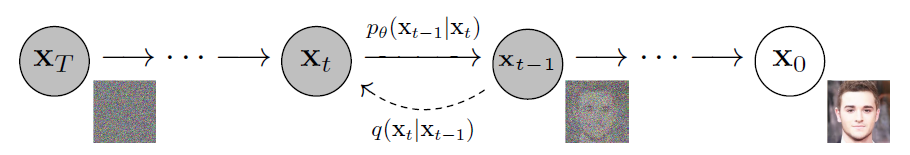

# 扩散模型DDPM/DDIM
!!!abstrat
    这里是 DDPM 和 DDIM 的论文阅读笔记
扩散模型的核心思想是模拟一个**逐步添加噪声再反向去噪的过程**，今年来在生成式任务重表现出色，特别是在图像生成领域。

## DDPM
### 原理
这是扩散模型的奠基之作，但是最初的扩散模型有个大问题是反向过程的步数太多导致推理效率低下，这也是之后主要的优化方向。

#### 概览
DDPM（Denoising Diffusion Probabilistic Model）包含一个正向过程和一个逆向过程：
* 正向过程：向原始图像重不断添加噪声直至成为完全的噪声
* 逆向过程：从最终的噪声尝试还原原始图像



#### 正向过程

正向过程被描述成了一个马尔科夫链 $q(x_T:x_0)=\Pi_{t=1}^Tq(x_t|x_{t-1}) $，每一步变换都服从正态分布$q(x_T|x_{T-1})=\mathcal{N}(x_t;\sqrt{1-\beta_t}x_{t-1},\beta_t I) $，根据正态分布的性质可以求得我们其实可以直接从$x_0 $推到$x_t $，即$q(x_t|x_0)=\mathcal{N}(x_t;\sqrt{\overline{\alpha}}x_0,(1-\sqrt{\overline{\alpha}})I) $，其中$\alpha=1-\beta $

#### 逆向过程

然后我们要尝试逆向上面的过程，根据贝叶斯公式$q(x_{t-1}|x_t)=\frac{q(x_t,x_{t-1})}{q(x_t)}=\frac{q(x_{t-1})q(x_t|x_{t-1})}{q(x_t)} $

假设我们已知$x_0$，上式左右加$x_0 $，则有$q(x_{t-1}|x_t,x_0)=\frac{q(x_{t-1}|x_0)q(x_t|x_{t-1},x_0)}{q(x_t)|x_0} $

根据上面的推导我们知道$q(x_{t-1}|x_0) $和$q(x_t)|x_0 $其实都是已经有公式可以代入的，目前还缺$q(x_t|x_{t-1},x_0) $，不过这一项也是可以通过推导得到它服从正态分布，并且均值含$x_0 $，**方差与$x_0 $无关**

故$x_0 $就是这个体系中的唯一未知量，但是实情境下我们并不知道原始图像，所以我们要用神经网络（论文选用了UNet）去估计反向过程，优化目标是尽量使反向过程近似于正向过程的逆过程，损失函数也由此定义，这个相似程度可以用$KL $散度描述(不过取了负对数)

### 代码实现
!!!note
    这里主要是提及一些代码技巧，因为这个demo写的真的很工程化！

#### 主函数
DDPM确实超级慢，本地基本跑不出来，这里有一个[Pytorch实现的demo](https://github.com/w86763777/pytorch-ddpm#)，它使用了Google的`absl`库，把Python代码工程化了类似于C++的形式并且支持命令行参数的解析，主函数直接长这样了
``` py
if __name__ == '__main__':
    app.run(main)
```
它使用的是CV常见的数据集CIFAR-10，是小图像（32x32）数据集，适合入门和轻量模型实验，但哪怕这样DDPM也根本跑不出来

它在加载数据时用到了一个技巧,将 dataloader 转换成一个无限循环的生成器通常用于训练深度学习模型时，不想在每个 epoch 都重新创建 DataLoader
```py
datalooper = infiniteloop(dataloader)
```

核心类有：
* `GaussianDiffusionTrainer`：训练时的前向传播和损失计算
* `GaussianDiffusionSampler`：采样时从噪声中生成图像

这段代码支持EMA，EMA 是 Exponential Moving Average（指数移动平均） 的缩写，在深度学习中，常用于模型参数的平滑更新，以提升模型的泛化能力，尤其是在生成模型（如扩散模型、GAN） 中非常常见

#### 逆向过程
正向过程相对比较简单，就是一个逐步添加噪声的过程，

## DDIM
### 原理
DDIM其实在DDPM三个月之后就有了，它相比DDPM主要有三点优化：
* 非马尔科夫链的正向过程
* 多步采样，加速反向过程
* 相同的初始噪声能够反向得到相同的$X_0 $

在 DDPM 中，采样的过程是从高斯噪声开始，逐步去噪。其采样步骤如下：$x_{t-1}=\frac{1}{\sqrt{\alpha_t}}(x_t-\frac{1-\alpha_t}{\sqrt{1-\overline{\alpha}}}*\epsilon_{\theta}(x_t,t))+\delta_tz $，其中$z $是满足正态分布的随机噪声，所以采样是随机的，而在DDIM中上述公式变成了$x_{t-1}=\sqrt{\overline{\alpha}_{t-1}}x_0+\sqrt{1-\overline{\alpha}_{t-1}}\epsilon_{\theta}(x_t,t) $，移除了随机项。简单来说就是DDIM省略反向扩散过程中的随机噪声项，使采样轨迹由网络输出唯一决定，从而实现了可重复的生成。

### 代码实现


## 相关知识

### 马尔科夫链
马尔科夫链是一系列的随机变量$X_0,X_1,...,X_n $，其中$X_i(0\leq i < n) $的分布只取决于$X_{i-1} $，类似与动态规划算法里面的无后效性

### KL散度
KL 散度，也可以叫做相对熵，是用于描述两个概率分布相似程度的量，离散概率分布求和，连续则求积分，当KL散度越大的时候，说明两者的差异程度越大；而当KL散度小的时候，则说明两者的差异程度小。如果两者相同的话，则该KL散度应该为0。

KL散度定义为，假设有两个概率分布$P$和$Q$，它们的概率分布函数是$p(x) $和$q(x) $，如果用$q(x) $去近似$p(x) $，那么$KL(P||Q)=\int p(x)\log\frac{p(x)}{q(x)}dx $