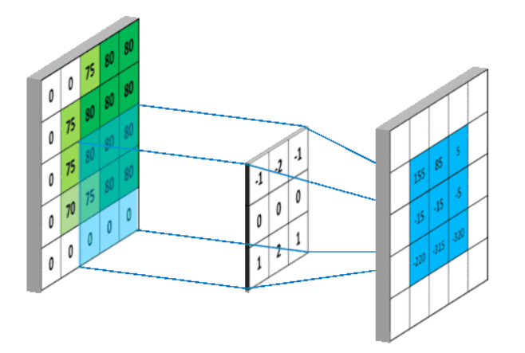
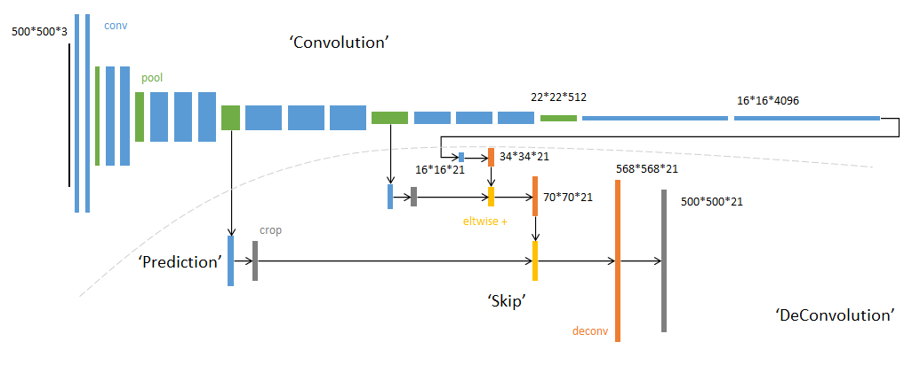
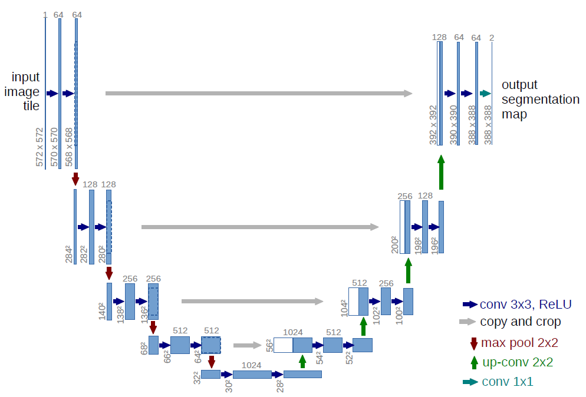

# UNet
## 背景
DDPM 在反向过程的时候选择使用了UNet模型，所以这里做一个补充。CNN已经存在很多年了，最早大概可以追溯到1962年，但是它的作用一直受到限制，CNN的原理就是通过卷积核获取图像的空间关系特征，并使用BP（反向传播）算法调整卷积核的参数，最终得到一个可以有效获取图片内有用信息的模型，参考[我CNN的笔记]()。

UNet 是基于全卷积神经网络（FCN）提出的，FCN将传统的CNN的全连接层换成了卷积层，这样的网络输出的是热力图而非类别，最常用于语义分割任务。

UNet的结构主要包含两部分：
* 编码器：提取图像的高层语义，每下采样一次，特征图尺寸减半，通道数加倍。
* 解码器：逐步恢复空间分辨率，每上采样一次，特征图尺寸加倍，通道数减半

