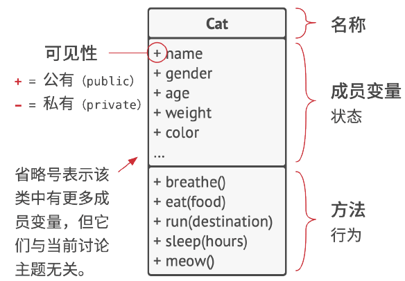
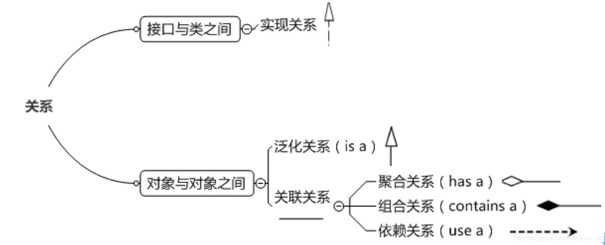

# 软件设计原则

## UML 类图

### 类

#### 具体类

面向对象的三大特性已经是老生常谈了，这里不再赘述。这里来看看 UML 类图，软工基课程报告里面画过，大概像下面这样：



具体类在类图中用矩形框表示，矩形框分为三层：第一层是类名字。第二层是类的成员变量；第三层是类的方法。成员变量以及方法前的访问修饰符用符号来表示：

- `+`：public
- `-`：private
- `#`：protected

#### 抽象类

抽象类在UML类图中同样用矩形框表示，但是抽象类的类名以及抽象方法的名字都用*斜体字*表示。

#### 接口

接口在类图中也是用矩形框表示，但是与类的表示法不同的是，接口在类图中的第一层顶端用构造型 `<<interface>>` 表示，下面是接口的名字，第二层是接口的方法。

### 关系

可以总结为以下这张图：



#### 实现关系

实现关系表示一个类（实现者）遵循另一个类型（接口）定义的契约。C#使用冒号 : 来表示类实现接口。实现接口的类必须提供接口中所有成员的具体实现。

```cs
public interface IDrawable
{
    void Draw();
}

public class Circle : IDrawable // Circle 实现了 IDrawable 接口
{
    public void Draw()
    {
        Console.WriteLine("Drawing a circle.");
    }
}
```

#### 泛化关系

泛化关系就是我们常说的继承。一个类（子类/派生类）从另一个类（父类/基类）继承其属性和行为。子类在父类的基础上可以扩展功能或修改行为。在C#中，继承也通过冒号 : 来表示。

```cs
public class Animal
{
    public void Eat()
    {
        Console.WriteLine("Animal is eating.");
    }
}

public class Dog : Animal // Dog 泛化自 Animal，即 Dog 继承 Animal
{
    public void Bark()
    {
        Console.WriteLine("Woof!");
    }
}
```

#### 聚合关系

聚合关系描述的是一种“整体与部分”的关系，其中部分可以独立于整体存在，并可以被多个整体共享。这种关系强调了整体与部分之间的松散耦合，部分即使脱离了当前整体也能继续存在。

特点：

1. 整体与部分的生命周期可以不同步。
2. 部分可以属于或共享给多个整体。
3. 通常通过引用类型成员变量实现。

```cs
// 部门与员工的关系。一个员工可以调岗到其他部门，部门解散后员工仍旧存在。
public class Employee
{
    public string Name { get; set; }
    // ... 其他员工属性
}

public class Department
{
    public List<Employee> Employees { get; set; } // 部门聚合了员工

    public Department()
    {
        Employees = new List<Employee>();
    }
}
```

#### 组合关系

组合关系是比聚合更强的一种“整体与部分”关系。在这种关系中，部分是整体不可分割的一部分，其生命周期完全依赖于整体。如果整体被销毁，部分也随之销毁，且部分不能被其他整体共享。整体负责部分的创建和销毁。

特点：

1. 整体与部分的生命周期严格同步。
2. 部分只能属于一个整体。
3. 通常在整体的构造函数中创建部分，并在整体的生命周期结束时（或通过显式处置）销毁部分。

```cs
// 人与头、躯干、四肢的关系。一个人的头、躯干、四肢与人的生命周期同步，
// 人死亡时，这些部分也随之“死亡”。
public class Head { /* ... */ }
public class Torso { /* ... */ }
public class Limb { /* ... */ }

public class Person
{
    public Head PersonHead { get; private set; } // 组合关系：人拥有一个头
    public Torso PersonTorso { get; private set; } // 组合关系：人拥有一个躯干
    public List<Limb> PersonLimbs { get; private set; } // 组合关系：人拥有四肢

    public Person()
    {
        // 人被创建时，其组成部分也被创建
        PersonHead = new Head();
        PersonTorso = new Torso();
        PersonLimbs = new List<Limb> { new Limb(), new Limb(), new Limb(), new Limb() };
    }
    // 当Person对象被垃圾回收时，其内部的Head、Torso、Limb对象也会随之被回收
}
```

#### 依赖关系

依赖关系是最弱的一种关系，表示一个对象使用了另一个对象，但这种使用不是持久的，通常是临时的或者通过方法调用。如果对象A依赖于对象B，则A“使用”了B。这种关系体现为B作为A的局部变量、方法的参数或返回值，或者A调用了B的静态方法。

```cs
public class Driver
{
    public Car Car { get; set; } // Driver依赖Car

    public void Drive()
    {
        Car.Start(); // 调用Car的静态方法
        // ...
    }
}
```

## 优秀设计的特征

### 代码复用

代码复用是降低开发成本最常用的手段之一。早期，面向对象编程（OOP）在推广继承时，强调其主要目的是实现代码复用。然而，在实际开发中，我们逐渐发现继承的局限性。许多时候，子类不得不 **重写（Override** 父类的方法，这使得继承在实现真正意义上的代码复用方面显得力不从心，甚至可能引入复杂的耦合关系。因此，如何在不引入过多复杂性的前提下有效地实现代码复用，仍然是软件设计中的一个挑战。

### 扩展性

“世界上唯一不变的就是变化”，这句话在软件开发领域体现得淋漓尽致。软件系统总会面临各种变化，例如：

- 平台迁移： 一个在Windows上开发的应用程序，如果需要移植到Linux或macOS上运行，其扩展性不足可能导致需要大量甚至重新开发的工作。
- 技术栈更新： 所使用的技术栈被淘汰或有新的更优选择时，一个扩展性差的系统将难以适应。
- 需求变更： 业务需求的不断演进，是软件开发中最常见的变化。

面对这些变化，重构在软件开发过程中扮演着至关重要的角色。它不仅能提升代码质量和团队技术水平，更是为了让系统能够适应新的需求和环境变化。具备良好扩展性的软件系统，能以更低的成本和更高的效率适应这些变化。

## 设计原则

### 封装变化的内容

这个原则的核心思想是：找到程序中会变化的部分，并将其与相对稳定的部分区分开来，进行封装。 这样做的主要目的是将变更造成的影响最小化。封装的结果是将变化的部分隐藏起来，形成独立的模块。当变化发生时，我们只需要修改被封装的变化内容，而不需要触及或修改系统中的其他不变部分。例如前端将频繁变化的UI组件（如某个特定数据展示方式的组件）封装起来，通过组件参数和事件回调与外部交互，这样当UI样式或逻辑变化时，只修改该组件即可。

### 面向接口而不是实现

这是软件设计中最重要的原则之一，它强调：依赖于抽象（接口或抽象类），而不是依赖于具体的实现类。 也就是说，我们在设计模块之间的交互时，应该让它们依赖于更抽象的接口，而不是某个具体的类。这样做的核心优势是降低了模块之间的耦合度，当底层实现发生变化时，上层调用者无需修改，典型示例就是依赖注入。

### 组合优于继承

继承（“Is-A”关系）表达的是一种强耦合的“是”关系。子类继承了父类的所有属性和行为，并且这种关系在编译时就已经确定。这意味着一旦父类发生变化，所有子类都可能受到影响。此外，继承层次过深会使系统变得复杂且难以理解，并且可能出现“脆弱的基类”问题，即基类的微小改动可能破坏子类的功能。

相比之下，组合（“Has-A”关系）表达的是一种弱耦合的“拥有”关系。一个对象通过包含另一个对象来获得其功能，而不是继承。这种关系在运行时可以动态地建立和修改，提供了更大的灵活性。当需要复用功能时，我们可以将拥有特定功能的类作为一个组件，在其他类中引入它的实例，从而实现功能的复用。

例如前端创建可复用的组件（Component），这些组件内部封装了特定的UI和逻辑。其他父组件可以通过组合这些子组件来构建更复杂的界面。例如，一个UserList组件可以组合多个UserCard组件。

## SOLID 原则

### 单一职责原则

单一职责原则 (Single Responsibility Principle )，其核心思想是一个类应该只有一个改变的理由。换句话说，一个类或模块应该只负责一项功能。这样做的好处是降低耦合度，提高内聚性，更容易测试和维护。例如一个负责用户认证的类，就不应该同时负责用户的日志记录，应该单独创建一个日志记录的类。

### 开闭原则

开闭原则 (Open/Closed Principle)，其核心思想是 软件实体（类、模块、函数等）应该对扩展开放，对修改关闭。这意味着在不修改现有代码的情况下，可以增加新功能。这样做的好处是提高系统的可扩展性和稳定性，减少引入新功能时对现有代码的破坏。例如使用接口或抽象类来定义行为，然后通过实现或继承来添加新功能，而不是直接修改现有的实现。

### 里氏替换原则

里氏替换原则 (Liskov Substitution Principle) ，其核心思想是子类型必须能够替换掉它们的基类型而不会破坏程序的正确性。简单来说，子类应该能够完全替代父类，并且程序的行为不会发生变化。这样做的好处是确保继承的正确使用，避免不必要的类型检查和条件逻辑，提高代码的健壮性。

### 接口隔离原则

接口隔离原则 (Interface Segregation Principle) ，其核心思想是客户端不应该被强制依赖它们不使用的接口。一个类不应该实现它不需要的方法。这样做的好处是避免“胖接口”，降低类之间的耦合度，提高系统的灵活性。例如一个多功能的接口可以拆分成多个小的、专注的接口，这样不同的客户端可以只实现它们需要的接口。

### 依赖倒置原则

依赖倒置原则 (Dependency Inversion Principle) ，其核心思想是高层模块不应该依赖低层模块，两者都应该依赖抽象。抽象不应该依赖细节，细节应该依赖抽象。这样做的好处是降低模块之间的耦合度，提高系统的灵活性和可维护性。例如一个订单处理模块（高层）不应该直接依赖于具体的数据库访问模块（低层），而是应该依赖于一个数据存储接口（抽象），然后具体的数据库访问模块实现这个接口。
